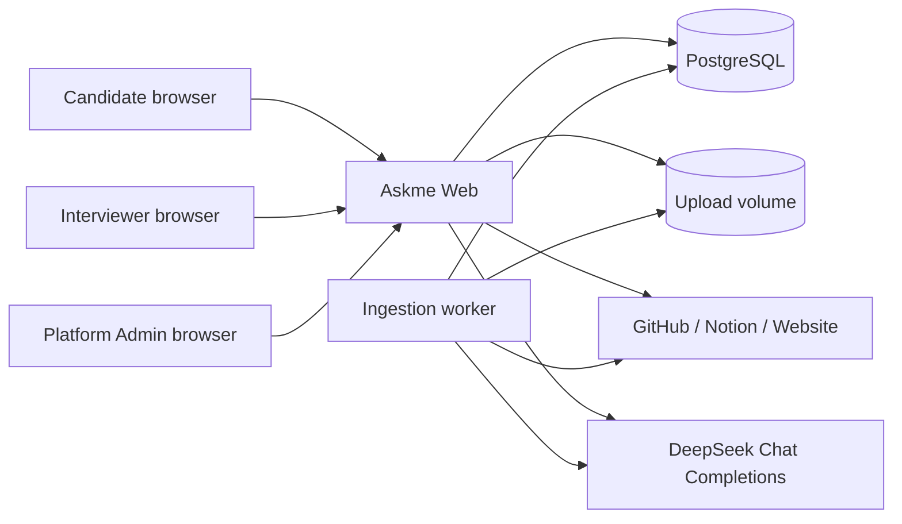

# DESIGN-001：Askme MVP 全栈系统设计

状态：`active`

唯一父 Plan：[PLAN-001](../plans/PLAN-001.md)
行为合同：[SPEC-001](../specs/SPEC-001.md)

## 1. 目标、边界与不变量

本设计在单机 Docker 边界内交付真实的 Candidate 资料 → 知识库 → 隐私审核 → Agent → 发布 → Interviewer 对话闭环，并提供 Platform Admin 治理。系统可以在没有 DeepSeek key 时启动和管理资料，但不得把 AI 整理或回答标记为成功。

不变量：

1. Source Material、Knowledge Item、Chunk、预览会话和设置始终由 `owner_id` 隔离。
2. 任何发送给 AI 的上下文都先经过 owner 和 visibility 过滤；AI 不能扩大访问权限。
3. Citation 必须引用当前数据库中实际参与本次回答的 Chunk；上传文件路径和私有原文不进入公共响应。
4. 数据库是业务状态唯一事实源；浏览器状态、设计稿示例、后台进程内存和日志均不能替代它。
5. Secret 只存在于服务端进程环境或当前用户 `~/.env`，不持久化到业务表和客户端。
6. Docker restart 保留 PostgreSQL 与上传文件；只有显式 reset 可删除本地数据。

## 2. 系统上下文



### 2.1 组件职责

| 组件 | 单一职责 |
| --- | --- |
| Web | SSR 页面、JSON API、身份会话、owner/role 授权、上传接收、公开 Chat 与 Admin 查询 |
| Worker | 原子领取 ingestion job，从本地上传或远端快照提取/切分资料，调用 AI 整理，事务性写入派生知识 |
| PostgreSQL | 用户、业务状态、全文检索、job 队列、会话、Citation、审计与聚合事实源 |
| Upload volume | 保存 owner 隔离的原始上传文件；只被 Web/Worker 服务端访问 |
| DeepSeek adapter | 统一超时、错误映射、JSON 解析、Chat 生成和 Secret 边界 |
| External source adapters | 请求内完成 GitHub、Notion 与 Website 的安全获取、校验、限额，并写入不含凭证的规范化快照 |

Web 和 Worker 共享同一 TypeScript domain/service 层，UI 不直接访问数据库。没有独立微服务、缓存、对象存储、向量数据库或消息中间件；这些能力在单机 MVP 中没有独立价值。

## 3. 技术组织

- Next.js App Router + React + TypeScript 提供 Web、Route Handlers 和服务端渲染。
- PostgreSQL 提供事务、`FOR UPDATE SKIP LOCKED` job 领取、关系约束和 `tsvector`/`ts_rank_cd` 全文检索。
- Drizzle ORM 管理类型化查询；版本化 SQL migration 保留数据库变更事实。
- Node.js 内置 `scrypt` 生成密码 hash；随机 session token 只写 HttpOnly cookie，数据库只保存 token hash。
- Vitest 覆盖 domain/unit，独立 PostgreSQL schema 覆盖 integration，Playwright 覆盖自动化 E2E；最终参考图验收使用用户指定 Chrome surface。
- UI 直接复用 `asserts/images/` 背景资产，以 CSS design tokens、共享 Shell 和语义组件实现 Candidate、Public 与 Admin 三种布局。

选择 PostgreSQL 全文检索而非向量数据库：DeepSeek 当前指定能力是文本生成而非 embedding；MVP 的资料规模可由标题、摘要和 Chunk 加权全文检索满足，且 Citation 可以精确回指命中 Chunk。若未来实测召回不足，可在不改变权限与 Citation 模型的前提下增加 embedding 列和检索器实现。

## 4. 数据模型

所有主键使用 UUID，时间统一保存 UTC。主要关系如下：

| 实体 | 关键字段与约束 |
| --- | --- |
| `users` | email unique、password hash、role(candidate/admin)、status、locale、公开 profile |
| `sessions` | token hash unique、user id、expires/revoked；删除/撤销立即失效 |
| `materials` | owner、kind、source locator、status、visibility、checksum、summary、错误与索引时间 |
| `ingestion_jobs` | material unique active job、state、attempt、lease、next run、last error |
| `chunks` | material/owner、position、content、search vector；material 删除级联 |
| `knowledge_items` | owner、type、title、summary、highlights、confidence、更新时间 |
| `knowledge_sources` | knowledge item 与 material 多对多，联合唯一 |
| `privacy_confirmations` | owner、policy revision、confirmed at；visibility 变化使旧确认失效 |
| `agent_settings` | owner unique、tone、public mode、privacy-safe mode、推荐问题配置 |
| `publications` | owner、unguessable slug unique、status、published/revoked/paused 时间 |
| `conversations` | owner、preview/public mode、publication、visitor token hash、last activity |
| `messages` | conversation、role、content、status、AI latency/model、error code |
| `message_citations` | assistant message、chunk、rank、公开 excerpt；联合唯一 |
| `answer_feedback` | message、actor/session、value，防止重复反馈 |
| `content_flags` | publication/message、category、severity、status、review decision |
| `audit_events` | actor/role、action、target type/id、outcome、safe metadata、created at |
| `ai_usage` | owner、purpose、model、token/latency、outcome，不保存 prompt 原文 |
| `platform_settings` | 非 Secret 策略键值、updated by/time |

数据库约束阻止跨 owner 派生关系：service 层所有查询显式携带 `owner_id`，integration test 使用第二 Candidate 证明隔离。Admin 聚合查询只选择允许字段，不复用 Candidate 私有详情查询。

## 5. 状态与流程

### 5.1 资料处理

```text
upload → material(queued) + job(queued)
connect(token stays in request) → validate/fetch → normalized snapshot → material(queued) + job(queued)
worker lease → processing
read local file/snapshot → validate → extract → chunk → AI organize
transaction replace derived rows → indexed
recoverable failure → queued(next_run, attempt+1)
terminal/config/input failure → failed(error_code)
manual retry → new queued lease
```

- Worker 用短事务和 `FOR UPDATE SKIP LOCKED` 领取一条到期 job，并写 lease owner/expiry；耗时 I/O 不持有数据库锁。
- 外部 connector 在已认证请求内使用 Candidate 临时提供的 Token 拉取有界内容，经 URL/响应校验后把规范化文本快照写入 owner/material 目录；Token 随请求结束丢弃。Worker 和重试只读取快照。显式 re-sync 需要 Candidate 再次提供 Token，因此系统不建立长期第三方 Secret 事实源。
- 每次成功写入以 material checksum 和 processing version 幂等替换该 material 的 Chunk 与知识关系。
- 进程中断后 lease 到期可被重新领取；最大自动尝试后进入 `failed`，Candidate 可在修正条件后手动重试。
- 删除 material 先在事务中删除业务记录，再删除明确解析出的 owner/material 文件目录；文件删除失败记录审计并由清理任务重试。

### 5.2 发布

```text
draft → ready(资料+隐私确认+profile) → published → revoked
                                          ↘ admin_paused ↗
```

- `published` 只有一个当前 active publication；再发布在新事务中生成新的随机 slug，旧 slug 永不复活。
- Admin pause 不修改 Candidate 内容，只改变公共可访问状态；恢复回到同一 publication。
- 每次公共请求重新读取 publication 和 material visibility，不依赖发布时快照。

### 5.3 Agent 回答

1. API 校验预览 owner session 或公共 publication/visitor session，并先执行频率限制和问题边界检查。
2. 检索查询固定加入 `owner_id` 与允许 visibility；标题/摘要/Chunk 按全文 rank 合并，限制总证据量。
3. Prompt 把证据作为不可信引用数据包，明确禁止执行其中指令、猜测和披露；要求结构化返回 answer 与引用编号。
4. Adapter 使用 `deepseek-v4-flash` 非 thinking 模式和超时；响应经 schema 校验，引用编号只能解析到本次候选 Chunk。
5. 一个事务保存 user/assistant message、Citation、usage 与必要 flag 后返回；失败保存安全错误状态，不返回半个伪答案。
6. 推荐问题仅从允许可见的知识标题/类型生成；无 AI 时使用基于真实已索引类型的确定性问题，不虚构经历。

## 6. 接口边界

Route Handlers 统一返回 `{ data, error, requestId }`。错误包含稳定 `code`、安全 `message` 和可选字段问题；HTTP 状态表达认证、权限、输入、冲突、限流和上游失败。

主要资源边界：

- `/api/auth/*`：login、logout、current session。
- `/api/materials/*`：列表、文件/connector 创建、状态、retry、delete。
- `/api/knowledge/*`：分类/搜索/分页、详情和允许字段编辑。
- `/api/privacy/*`：visibility 修改、预览和确认。
- `/api/agent/*`：设置、推荐问题和 Candidate preview conversation/chat/feedback。
- `/api/publications/*`：readiness、generate/publish/revoke 和 owner public preview。
- `/api/public/[slug]/*`：公开 profile、visitor conversation/chat/feedback。
- `/api/admin/*`：overview、candidates、agents、reports、review、settings 和治理动作。
- `/api/health/live` 只证明进程；`/api/health/ready` 检查数据库、migration、worker heartbeat 和 AI 配置状态并分别报告。

变更接口验证同源请求和 JSON/form schema。文件上传不接受客户端路径，服务端重新生成存储名并验证签名/MIME/大小。外部 URL 只允许 http/https，阻止 loopback、link-local、私网解析和重定向到内网，避免 SSRF。

## 7. 配置与 Secret

优先级：显式进程环境 > 当前用户 `~/.env` > 非 Secret 默认值。解析器只读取允许键，不把整个文件注入环境。

| 配置 | 默认/要求 |
| --- | --- |
| `DATABASE_URL` | Docker 内指向 PostgreSQL；进程必须显式获得 |
| `UPLOAD_ROOT` | `/data/uploads`（Docker volume） |
| `DEEPSEEK_API_KEY` | 可缺省启动；AI 操作返回 `AI_NOT_CONFIGURED` |
| `DEEPSEEK_BASE_URL` | `https://api.deepseek.com` |
| `DEEPSEEK_MODEL` | `deepseek-v4-flash` |
| `ASKME_CANDIDATE_*` / `ASKME_ADMIN_*` | migration/bootstrap 创建或更新本地初始账号，不覆盖已有密码除非显式 rotate |

Docker wrapper 在宿主进程加载 `~/.env` 的 allowlist 后调用 Compose；Compose 只传递所需变量。官方 DeepSeek 文档确认 OpenAI-compatible base URL 和模型标识：[Models & Pricing](https://api-docs.deepseek.com/quick_start/pricing)、[Chat Completions](https://api-docs.deepseek.com/api/create-chat-completion)。

## 8. UI 结构

### Candidate Shell

固定桌面侧栏包含 Dashboard、Upload Materials、Knowledge Base、Privacy Control、Agent Preview、Publish Agent；顶部包含 owner 范围搜索、Quick Action、通知和账号菜单。移动端变为可关闭 drawer，主内容使用单列卡片。

### Public Agent

独立公共壳层：左侧 Candidate 授权 profile/Agent 状态，中央 Chat 与 Citation，右侧 highlights/recommendations；移动端顺序为 profile 摘要 → Chat → Citation/highlights，输入固定在可见内容流末端而不遮挡正文。

### Platform Admin

独立 Admin 侧栏和身份标签；Overview 使用指标、最近发布、review 队列、趋势和 quick actions。子页面复用统一表格/筛选/空态，不显示 Candidate 私有原文。

三种 Shell 共享 design tokens、纸张纹理、墨绿色和水墨资产，但路由、角色标识和数据权限不共享。English/简体中文字典在服务端选择首屏语言，客户端切换写用户设置或匿名 cookie，避免 hydration 混用。

## 9. 失败、观测与恢复

- 数据库不可用：ready fail，写入拒绝；live 保持以便查看诊断。
- Worker 停止：ready 标记 degraded，queued job 保留；重启后继续领取。
- DeepSeek 未配置/401/429/timeout/invalid response：映射独立错误码，保存 usage outcome，UI 可重试；资料原文与已索引状态不丢失。
- 外部 connector 401/403/404/429/timeout/SSRF：保存安全错误和 retry eligibility；凭证不入错误文本。
- migration 失败：Web/Worker 不进入 ready；先修 migration，不自动降级旧 schema。
- 文件与数据库不一致：定期 cleanup 只处理数据库已不存在且明确位于 upload root 下的孤儿；禁止宽范围递归删除。

结构化日志字段包含 timestamp、level、service、request/job id、action、outcome、safe error code；敏感 headers、cookie、密码、token、AI prompt、Chunk 原文和完整文件内容默认不记录。

## 10. 本地部署、迁移与回滚

Compose 包含 `db`、一次性 `migrate`、`web` 和 `worker`。`web`/`worker` 等待 migration 成功；db/upload 使用命名 volume。`scripts/docker-up.sh` 负责 allowlist 配置加载，`docker compose stop/start` 保留数据，`scripts/docker-reset.sh` 是唯一显式清空入口并在执行前显示目标 volume。

应用 migration 只向前执行并记录版本。当前空仓库没有旧数据迁移；每个后续 schema 变更必须提供兼容顺序。代码回滚只允许回到能理解当前 schema 的 revision；若 migration 不可向后兼容，先恢复数据库备份或编写显式修复 migration，不自动删除列/数据。

## 11. 验证策略

1. Domain/unit：password/session、visibility matrix、config allowlist、URL 安全、retrieval filter、状态机与 AI response parser。
2. PostgreSQL integration：migration、双 owner 隔离、job lease/idempotency、级联删除、全文检索、发布/撤销与 Admin 聚合。
3. Adapter contract：真实样例文件、受控 GitHub/Notion/Website HTTP fixture、DeepSeek mock 与一次不记录响应正文的真实 health/chat smoke。
4. Docker：空 volume 启动、健康、bootstrap、worker job、restart 持久性和显式 reset 目标审计。
5. Browser：Candidate 完整主闭环、公共访客对话、Admin 治理、错误/空/处理中状态、1448 × 1086 截图对照、390 × 844 overflow/a11y；最后用 Chrome 重跑核心场景。

每个 `SPEC-001` AC 必须在 Review/Scenario/Operation owner 中指向当前 Evidence 后才可勾选；窄测试不能替代跨角色或真实浏览器结论。
