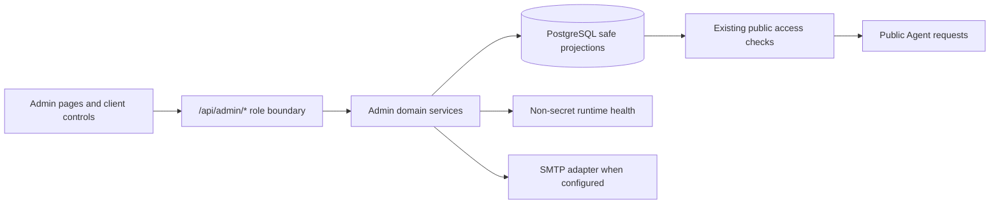

# DESIGN-002：Platform Admin 治理与真实数据投影

状态：`active`

唯一父 Plan：[PLAN-004](../plans/PLAN-004.md)
行为合同：[SPEC-001](../specs/SPEC-001.md)

## 1. 目标、范围与当前事实

本设计把现有鉴权占位页 `/admin` 交付为由 PostgreSQL、运行健康和审计事实驱动的 Platform Admin 工作区，覆盖 Overview、Candidates、Published Agents、Reports、Content Review、Settings、全局搜索与 Admin 邀请。Admin 只治理账号、公开 Agent、风险项和非 Secret 平台策略，不获得 Candidate 私有资料读取能力。

PLAN-004 Phase 1 的逐页数据 owner 审计结论如下：

| 用户表面 | 当前业务数据 owner | 审计结论 |
| --- | --- | --- |
| `/login`、`/api/auth/*` | `users`、`sessions` 与真实凭证校验 | 没有 mock 登录或静态成功态 |
| Candidate Dashboard | `dashboard-service` 对 `materials`、`knowledge_items`、`publications`、worker/config 的聚合 | 指标、流程状态、最近资料和下一步均由当前事实派生 |
| Materials / Knowledge / Privacy | owner-scoped API、上传 volume、ingestion job、知识与可见性表 | 列表、状态、筛选、分页和写操作均有服务端 owner；权限矩阵是产品规则，不是业务样例 |
| Candidate Agent / Publish | 会话、消息、Citation、设置与 publication 状态 | 对话、推荐问题、反馈、发布与链接均由数据库和 DeepSeek 驱动 |
| `/a/[slug]` | 当前 publication、公开 profile、允许可见的知识/Chunk、visitor session | 无静态 Candidate 或回答；空态与拒绝态是实际状态投影 |
| Platform Admin | 仅 `requirePageUser("admin")` 的占位页 | 缺少全部治理查询、写入 API 和设计稿界面，是本设计唯一主要产品缺口 |

导航、按钮文案、状态标签、产品枚举、日期格式和权限能力矩阵可以保留为代码内产品定义；Candidate、Agent、资料、趋势、计数、风险和成功结果不得由常量数组、设计稿示例或浏览器内存伪造。`scripts/bootstrap.ts` 只创建持久化的本地真实账号，测试 fixture 只存在于测试/Smoke 入口，二者不作为产品页面数据源。

本设计不交付多语言、最终全站键盘可访问性或整个 Objective 的 from-zero 总验收；这些仍由 PLAN-004 之后的正式 Plan 承担。

## 2. 治理不变量

1. 所有 `/admin` 页面和 `/api/admin/*` Route Handler 都在服务端要求当前 `admin` session；Candidate 与匿名访问分别返回重定向或 `403/401`。
2. Admin 查询禁止选择或返回 `materials.storage_path`、Chunk/Source Material 原文、私有 Knowledge Item 详情、消息正文、AI prompt、session token、密码 hash 和任何 Secret。Content Review 只读取 `safe_summary`、类别、严重度、状态、公开 Agent 标识和时间。
3. Candidate 账号状态仍以 `users.status` 为唯一事实源。暂停账号时同一事务更新状态、撤销未失效 session 并写审计；公共 Agent 已经在每次请求时连接 `users.status='active'`，因此立即不可用。恢复账号不恢复旧 session，用户必须重新登录。
4. Agent 治理状态仍以 `publications.status` 为唯一事实源。Admin 只允许 `published → paused → published`；Candidate 可将 `paused` publication 撤销，Admin 不得恢复 `revoked`。每次公共请求重新读取状态。
5. Admin 写入使用目标行锁或带期望状态的条件更新；状态已经变化时返回 `409`，不覆盖并发的 Candidate 或其他 Admin 决策。
6. 每个账号、Agent、内容审查、平台策略和邀请动作都写 `audit_events`，metadata 只保存状态、原因、策略键和安全计数，不保存私有原文或 Secret。
7. `platform_settings` 只接收服务端 allowlist 中的已知非 Secret 策略；数据库中的任意未知键不会被 UI 当作受支持策略，也不会透传到客户端。
8. 聚合与趋势只计算当前数据库事实。日期桶可以补零以保持时间轴连续，但无事件时 UI 明确显示空态，不生成样例曲线、虚构同比或设计稿姓名。

## 3. 能力、组件与依赖方向

| 组件 | 职责 |
| --- | --- |
| `src/server/admin/overview-service.ts` | Overview 指标、最近发布、审查队列与时间趋势 |
| `candidate-service.ts` | Candidate 安全列表、搜索、分页、暂停/恢复、session 撤销与审计 |
| `publication-service.ts` | 已发布 Agent 安全列表、公共页链接、治理暂停/恢复与审计 |
| `report-service.ts` | 7/30/90 天真实趋势与分布，不返回样例序列 |
| `review-service.ts` | Content Flag 安全投影、状态机、决定说明与审计 |
| `settings-service.ts` | AI/数据库/migration/worker/邮件健康、安全配置和平台策略 |
| `search-service.ts` | Candidate、公开 Agent 与风险安全摘要的跨域搜索，不搜索私有原文 |
| `invitation-service.ts` + SMTP adapter | 创建一次性邀请、真实发送、接受或失败状态；未配置时显式拒绝 |
| `AdminShell` 与领域页面 | 设计稿布局、查询参数、分页、表单反馈和移动导航；不持有独立业务事实 |

UI 可在 Server Component 首屏读取服务层，并由 Client Component 通过同一 API 完成后续筛选和写入。API 与 SSR 调用共享 domain service，避免页面和接口各自实现一套授权或聚合语义。

## 4. 安全投影与 API 契约

Route Handler 继续使用统一 `{ data, error, requestId }` envelope；所有列表默认 `page=1`、`pageSize=20`，最大 `100`，稳定以时间与 UUID 作为次排序键。

| 接口 | 主要输入 | 安全输出 / 行为 |
| --- | --- | --- |
| `GET /api/admin/overview?range=7d|30d|90d` | 时间范围 | Candidate、Published Agent、活跃 Interview、公开 Citation 使用、待审 Flag；最近发布、review 队列、每日趋势与可比较时的前期变化 |
| `GET /api/admin/candidates` | `search`、`status`、分页 | id、姓名、email、账号状态、创建/更新时间、资料/知识计数与 publication 状态 |
| `PATCH /api/admin/candidates/[id]` | `status`、3–500 字原因 | 仅 Candidate；暂停时撤销 session，恢复不恢复 session；幂等重复返回当前状态，冲突返回 `409` |
| `GET /api/admin/agents` | `search`、`status`、分页 | publication id/slug/status/时间、Candidate 公开 identity、公开资料/知识计数和可打开的公共 URL |
| `PATCH /api/admin/agents/[id]` | `action=pause|restore`、原因 | 原子状态转换与审计；账号被暂停或 publication 已撤销时拒绝恢复 |
| `GET /api/admin/reports?range=...` | 时间范围 | Candidate、发布、Interview、Citation、Flag、AI outcome 的日期桶和实际合计；全零时 `hasData=false` |
| `GET /api/admin/reviews` | `search`、`status`、`severity`、分页 | Flag id/category/severity/status/safe summary、公开 Agent 标识、review 元数据；不返回 message content 或 Citation excerpt |
| `PATCH /api/admin/reviews/[id]` | `action=review|resolve|dismiss`、决定说明 | `open→reviewing`、`open/reviewing→resolved|dismissed`；终态不被隐式重开 |
| `GET/PATCH /api/admin/settings` | 已知策略对象 | 健康、非 Secret 配置、邮件能力与解析后的策略；PATCH 原子 upsert allowlist 键并审计 |
| `GET /api/admin/search?q=...` | 2–120 字 | 最多各 10 个 Candidate、公开 Agent 和风险安全摘要结果 |
| `POST /api/admin/invitations` | email、display name | 只有完整 SMTP 配置时创建并发送一次性 Admin 邀请；响应不含 token |
| `POST /api/invitations/[token]/accept` | display name、密码 | 校验 hash、有效期和单次状态，在事务中创建真实 Admin 账号并接受邀请 |

Overview 指标定义：

- Total Candidates：`users.role='candidate'` 的当前总数，状态分布另行返回。
- Published Agents：`publications.status='published'` 且 owner active、`agent_settings.public_mode=true` 的当前可访问数量。
- Active Interviews：当前未过期且最近 24 小时有活动的 public conversation 数。
- Citation Usage：所选范围内 public assistant message 的 `message_citations` 记录数；这是实际使用事件，不等于当前可见资料数。
- Flagged Content：`content_flags.status IN ('open','reviewing')` 的当前待处理数。
- 趋势：按所选时区无关的 UTC 日期统计 Candidate 创建、publication 首次发布、public conversation、public Citation 与 Flag 创建事件。

变化率只在前一个等长区间基数大于零时返回数值；否则返回 `null` 并由 UI 显示 “No prior baseline”。

## 5. 状态、持久化与 migration

### 5.1 复用状态

- `users.status`、`sessions.revoked_at`：账号启停与立即失效。
- `publications.status/paused_at/pause_reason`：Agent 治理暂停与恢复。
- `content_flags.status/reviewed_by/decision_note/reviewed_at`：内容审查。
- `platform_settings`：已知非 Secret 策略。
- `audit_events`：治理、设置和邀请的不可变结果记录。

### 5.2 新增和加固

兼容 migration 只做可向前应用的增量变更：

1. 新增 `admin_invitations`，保存规范化 email、display name、token hash、`pending/sent/accepted/failed/revoked` 状态、有效期、邀请人、发送/接受/失败时间与安全错误码；数据库不保存明文 token。
2. 为同一 `message_id + category` 的 Content Flag 建立唯一约束；迁移先保留最近状态并清理历史重复，后续生产者使用 `ON CONFLICT DO NOTHING` 保证 feedback 重放幂等。
3. 为 Content Flag 添加状态字段一致性约束：`open` 不带 review 元数据，`reviewing/resolved/dismissed` 必须有 reviewer 与 review 时间，终态必须有非空决定说明。
4. 为 `publications` 加固 paused reason：进入 `paused` 必须有非空原因；恢复时清空 `paused_at/pause_reason`。migration 先为既有 paused 行补安全通用原因，不猜测私有业务内容。
5. 增加 Admin 列表与趋势使用的时间/状态索引；不复制聚合表或缓存计数。

`platform_settings` 当前策略键：

| 键 | 默认 | 约束与消费者 |
| --- | --- | --- |
| `public_session_hourly_limit` | `20` | 整数 1–100；公共 session 创建限流 |
| `public_chat_minute_limit` | `10` | 整数 1–60；公共提问分钟限流 |
| `public_chat_daily_limit` | `100` | 整数 1–500；公共提问日限流 |
| `negative_feedback_auto_flag` | `true` | boolean；公共 down feedback 是否进入 review queue |

读取缺失键时返回默认值；PATCH 只更新显式提交键。任何 Secret、DeepSeek key、SMTP password、数据库 URL 都没有 setting key，也不进入响应。

### 5.3 风险项生产

公共 Chat 在同一业务事务中产生安全 Flag：

- Interviewer down feedback：`visitor_negative_feedback/low`；
- 安全规则拒绝隐私越权或提示注入：按稳定错误码映射为安全 category/severity，不保存问题正文；
- 完成的回答没有 Citation 或返回不足证据：`missing_citation/medium`，safe summary 只描述结果类型。

这些 Flag 只关联 publication/message id 和安全摘要。Admin 可据此治理公开 Agent，但不能从 review API 展开 user/assistant message 或底层证据。

## 6. 平台设置、健康与真实邮件

Settings 聚合以下当前事实：

- Database：执行 `SELECT 1` 的结果；migration：`schema_migrations` 版本数与当前代码预期；
- Worker：最近 heartbeat、版本和 `ready/stale`；
- AI：是否配置、模型名、非 Secret base URL、最近 usage 成功/失败与时间；
- Mail：`configured/not_configured`、非 Secret from/host 标签；只有 host、port、secure、from 及可选成对 auth 配置完整时才是 configured。

SMTP 由进程环境或 `~/.env` allowlist 读取 `ASKME_SMTP_HOST`、`ASKME_SMTP_PORT`、`ASKME_SMTP_SECURE`、`ASKME_SMTP_USER`、`ASKME_SMTP_PASSWORD`、`ASKME_SMTP_FROM`。用户名与密码必须同时出现或同时缺失；客户端永远只收到 capability 与非 Secret label。

邀请流程先在数据库创建 `pending` 记录和随机 token hash，再调用 SMTP 发送基于当前可信 request origin 的一次性链接。发送成功更新为 `sent`；失败更新为 `failed` 并写安全错误码，UI 明确失败且可新建邀请。接受链接只允许 `sent`、未过期、未使用的 token；密码 hash 与用户创建、邀请 `accepted` 和审计在同一事务完成。

## 7. UI 投影

Admin 使用与 `frontend_index.png` 一致的独立侧栏、顶部搜索、Quick Action、通知不可用说明和 Platform Admin 身份菜单：

- Overview：五张真实指标卡、最近发布表、Review queue、范围切换趋势和真实 Quick Actions。
- Candidates：搜索、状态筛选、分页、计数与 suspend/restore reason dialog。
- Published Agents：搜索、状态筛选、公共页、pause/restore dialog；不可公开时按钮显示原因。
- Reports：7/30/90 天指标和可切换真实趋势；`hasData=false` 时显示空态而不画样例线。
- Content Review：安全摘要列表、筛选、review/resolve/dismiss；没有展开私有内容入口。
- Settings：运行健康、策略表单、邮件能力、Admin invite；邮件未配置时表单禁用并显示缺失能力。
- Search：显示 Candidate、Published Agent 和 Flag safe summary 三类真实结果；无结果时显示搜索空态。

桌面保持设计稿的信息层次；Chrome DevTools `iPhone 14 Pro Max`（430 × 932）下侧栏变为完成操作后默认关闭的 drawer，表格投影为可读卡片，不能产生水平页面溢出。治理 dialog 完成或取消后关闭；pending 时禁止重复提交，失败保留输入以便重试。

## 8. 失败、恢复、迁移与回滚

- 数据库或 migration 不健康：Admin 页面可显示已获得的安全诊断；治理写入失败且不伪造成功。
- Worker/AI/Mail 不健康：只标记对应 capability，不把整个 Admin 查询伪装成失败；依赖它们的动作禁用并说明原因。
- 账号或 publication 并发变化：条件更新返回 `409`，客户端刷新真实状态。
- SMTP 是事务外部副作用：数据库先记录 `pending`，发送结果必落 `sent/failed`；失败 token 不能接受，重试生成新邀请。
- migration 为加表、约束和索引；现有代码回滚后会忽略新表/列，现有用户、资料、publication 和消息不被删除。约束迁移失败时停止 web/worker ready，不自动改写业务数据。
- Admin 服务无需后台缓存；进程重启后全部状态从 PostgreSQL 和 runtime config 重建。

## 9. 验证

1. Unit/domain：查询输入、range、分页、策略 allowlist、状态机、健康投影、SMTP 配置与邀请 token。
2. PostgreSQL integration/smoke：Admin role、Candidate 暂停/恢复与 session 失效、Agent pause/restore 与公共请求即时传播、Content Flag 幂等/审查、策略持久化、审计字段和私有列禁区。
3. API/SSR：每个页面首屏与筛选、分页、搜索、dialog 结果都来自同一 service/API；空库证明没有示例姓名、指标或曲线。
4. Docker：migration、Admin smoke、worker/AI/DB health 与未配置邮件能力；不使用未观测的 SMTP 成功声明。
5. Chrome：1448 × 1086 和 DevTools `iPhone 14 Pro Max`（430 × 932）完成 Overview、Candidate suspend/restore、Agent pause/restore、Review 结论、Settings 策略、搜索与未配置邮件状态；检查 console 和水平 overflow。
