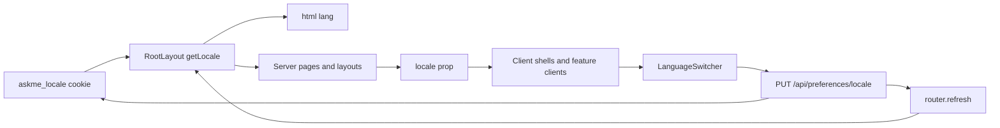

# DESIGN-003：全界面视觉、双语与可访问性闭环

状态：`active`

唯一父 Plan：[PLAN-005](../plans/PLAN-005.md)
行为合同：[SPEC-001](../specs/SPEC-001.md)

## 1. 目标、范围与不变量

本设计让七张 1448 × 1086 参考图对应的 Platform Admin、Candidate Workspace 与公共 Candidate Agent 在真实数据和真实交互基础上形成统一视觉合同，并以同一套 English / 简体中文状态覆盖服务端首屏、客户端交互和错误反馈。Chrome DevTools `iPhone 14 Pro Max`（430 × 932）是移动端唯一验收基线。

设计不新增业务样例、翻译平台、URL locale 前缀、用户语言数据库字段或新的产品能力。设计稿中的姓名、计数、时间、对话和资料只表达布局；页面继续只显示 PostgreSQL、运行时配置、上传文件和 DeepSeek 返回的当前事实。稳定错误码、API envelope、数据库枚举和审计事件不翻译，界面在显示边界把它们映射为当前语言。

不变量：

1. 默认语言始终是 English；只有受支持且已持久化的 `en` 或 `zh-CN` 才能改变下一次服务端渲染。
2. 同一次首屏的 `<html lang>`、Server Component、Client Component 初始 props 和可交互控件使用同一 locale，不允许先渲染 English 再在 hydration 后替换为中文。
3. 语言切换不改变业务数据、权限、路由、会话或公开链接；切换失败时保留当前完整语言，不形成混合界面。
4. 视觉对齐不能以静态设计稿数据替换空态、失败态或真实聚合，也不能为追求单屏截图隐藏合法内容或操作。
5. 关键状态同时使用文本或语义图标，不能只用颜色区分；键盘焦点始终可见。

## 2. 七图、路由与当前差距

2026-08-11 使用真实 Docker Web、PostgreSQL、worker 和 DeepSeek，在 Chrome 插件精确设置 1448 × 1086 后完成七图对应路由检查；Candidate 和公共 Agent 另在 430 × 932 检查，Platform Admin 移动端 Evidence 由 PLAN-004 的可见 DevTools `iPhone 14 Pro Max` 验收提供。七个桌面路由的 `documentElement.scrollWidth` 均等于 `innerWidth=1448`，已检查移动页面均为 `430`，未发现 Askme console warning/error。

| 参考图 | 路由与真实 owner | 已成立结构 | 本 Plan 需闭环的差距 |
| --- | --- | --- | --- |
| `frontend_index.png` | `/admin`；Admin 聚合 service、PostgreSQL、health/config | 272 px 固定侧栏、94 px 顶栏、五指标、最近发布、Review、趋势、Quick Actions 已与参考层次一致 | 补齐 Platform Admin 双语；语言入口从静态文字变为可操作控件；保留真实空态和 `No prior baseline`，不复刻示例数字 |
| `admin_dashboard.png` | `/workspace`；dashboard service | Candidate 侧栏/顶栏、水墨 hero、四指标、workflow、资料和下一步均为真实投影 | 双语；微调桌面垂直密度，使主要 lower grid 与页脚更接近参考视口，同时不截断动态内容 |
| `admin_uploadfile.png` | `/workspace/materials`；上传 API、ingestion job、外部连接 API | 拖放/选择、类型说明、处理状态、最近上传与外部来源均已连接真实行为 | 双语；压缩 hero、卡片间距和列表行高，让 Connect Sources 与关键反馈更接近首屏；失败资料继续显示真实原因 |
| `admin_knowledge.png` | `/workspace/knowledge`；Knowledge API 与 owner-scoped evidence | 分类、搜索、状态/Citation 筛选、列表/详情、编辑与分页为真实数据 | 双语；提高 1448 桌面列表密度并保持 master/detail 比例；移动端详情改为顺序布局，不能产生宽表溢出 |
| `admin_private_control.png` | `/workspace/privacy`；统一 visibility policy 与 confirmation revision | 来源可见性、能力矩阵、Interviewer Preview、发布前确认都来自服务端合同 | 双语；桌面压缩上部留白和卡片密度以呈现下部 Preview/Review；移动端表格用可读投影而非横向滚动 |
| `admin_agent_preview.png` | `/workspace/agent`；真实检索、DeepSeek、Citation 和 Agent settings | 实际提问已返回真实回答与 1 个来源，左右回答/Citation、设置和发布 CTA 结构成立 | 双语；回答态与空/失败态都需覆盖；调整对话/Citation 高度和 settings 密度，使发布 CTA 在参考视口内可发现 |
| `admin_publish.png` | `/a/[slug]`；公开 projection、visitor session、DeepSeek 与 public Citation | 左侧公开身份、Chat-first 主区、右侧亮点、推荐问题和下载链接结构成立；真实问答返回 1 个 public Citation | 匿名双语与错误反馈；优化回答态垂直占用及移动顺序，保证输入、推荐问题和 Citation 可完成且 profile 不造成横向溢出 |

真实 Candidate 名称、头像缺省状态、资料数量和回答长度与设计稿不同不属于视觉缺陷。验收比较固定侧栏/顶栏、hero、主列比例、卡片层次、操作位置、响应式顺序和可读密度；动态内容超出一屏时允许纵向滚动。

## 3. Locale 状态与接口合同

### 3.1 唯一状态

Locale 的唯一持久化 owner 是同源 cookie：

| 字段 | 合同 |
| --- | --- |
| 名称 | `askme_locale` |
| 值 | `en`、`zh-CN`；其他值按 `en` 处理 |
| 默认 | `en`，不根据 `Accept-Language` 自动改变 |
| 作用域 | `Path=/`，`SameSite=Lax`，最长一年 |
| 安全 | 由 Route Handler 写入；HTTPS 请求设置 `Secure`；locale 不含身份或敏感信息 |

不增加 locale URL segment，因为现有公开 opaque link、登录回跳、Candidate/Admin 导航和外部分享 URL 都应保持稳定；同一 URL 的 cookie 偏好满足当前 Spec，也避免全路由迁移。

`PUT /api/preferences/locale` 接收 `{ "locale": "en" | "zh-CN" }`，沿用 `{ data, error, requestId }` envelope。成功响应写 cookie 并返回规范化 locale；无效输入返回稳定 `INVALID_LOCALE/400`。接口允许匿名使用，不读取或修改 session。

### 3.2 服务端与客户端一致性

- `src/i18n/catalog.ts` 是可在 server/client 共用的纯 TypeScript catalog，英文 key 集定义完整类型，中文 catalog 必须具有同一 key 集；`translate(locale,key,params)` 对运行时缺失项回退 English。
- `src/i18n/server.ts` 只负责 `await cookies()`、校验和默认值，不被 Client Component 引入。
- Root Layout 读取 locale 并设置 `<html lang="en|zh-CN">`；Workspace/Admin/Public/Login 的 Server Component 把同一 locale 与所需文案传入 Client Component。
- `LanguageSwitcher` 调用 locale API，只有成功后才 `router.refresh()`；pending 时禁用并提供状态，失败以当前语言的 `role="alert"` 显示且不乐观替换其他文案。
- Server Component 与 Client Component 都调用同一 catalog，不建立第二份 JSON、Context 状态或 `localStorage`。日期、数字继续由真实值生成，但使用与 locale 对应的 `Intl` locale 和显式 UTC 时区，避免 hydration 漂移。

## 4. 翻译覆盖边界

本 Plan 覆盖 `/`、`/login`、`/invite/[token]`、全部 `/workspace/*`、`/workspace/publish/preview`、`/a/[slug]` 及全部 `/admin/*` 的导航、标题、说明、按钮、表单 label/placeholder、筛选与分页、空态、pending、成功、错误和不可用页面。Candidate/Agent/资料标题、用户输入、AI 回答、Citation 摘要、审计原因和外部来源内容保持原文，不机器翻译用户数据。

API 保持英文诊断消息和稳定错误码。Client API 边界优先按错误码映射当前语言；未知错误使用当前语言的通用失败文案并保留 request id，既不泄露服务端细节，也不出现英文错误插入中文界面。

## 5. 组件职责与依赖方向

| 组件 | 单一职责 |
| --- | --- |
| `catalog.ts` | locale 类型、key 完整性、参数插值和 English fallback |
| `server.ts` | 从 request cookie 得到规范化 locale |
| Locale Route Handler | 校验、写 cookie、返回 envelope |
| `LanguageSwitcher` | 提交选择、pending/error、刷新 server tree |
| Root/Workspace/Admin layouts | 统一 `<html lang>`，向 shell 传 locale，不持有另一份语言状态 |
| Candidate/Admin/Public shells | 翻译共享导航、身份标签、Quick Actions、footer 并渲染切换入口 |
| 各页面/feature client | 翻译本领域固定 UI；真实业务数据与 API 状态保持原 owner |

不引入第三方 i18n runtime：仅两种 locale、无复数规则扩展和 URL 路由需求，类型化本地 catalog 已足够，新增依赖只会制造重复状态和 bundle 成本。

## 6. 视觉与响应式合同

1. 桌面使用现有 272 px sidebar、94 px topbar 和参考图同源水墨资产；Platform Admin 与 Candidate 主内容以 43 px 左右 padding 为基线，公共页保持 285 px profile/sidebar 与 Chat 主列。
2. `frontend_bg_left.png` 只用于 Platform Admin 侧栏；`admin_bg_left.png` 用于 Candidate 侧栏；`admin_bg_head.png` 用于 Candidate/Admin hero；`frontend_bg_head.png` 用于公共 Agent。资产通过构建期 CSS URL 解析，不请求不存在的 public 路径。
3. 1448 × 1086 优先调小非内容性留白、行高和卡片 padding，不缩小可点击目标、不隐藏真实行、不固定动态回答高度。关键 CTA 可以在首屏附近，超长数据自然纵向滚动。
4. `max-width: 860px` 隐藏固定侧栏并显示顶部 drawer；`430 × 932` 是最终断点 Evidence。表格使用 `data-label` 卡片投影或语义分组，能力矩阵提供逐规则移动投影，不能以整页横向滚动解决。
5. 公共 Agent 移动顺序为 trust header → profile →主标题 → conversation → highlights/recommendations；Chat 输入在正常文档流中保持可触达，不覆盖回答或 iOS 安全区域。

## 7. 键盘与语义合同

1. 所有页面提供可见的 Skip to content，目标 `#main-content`；每页有唯一可描述的 `h1`，Next route announcer 可读。
2. 全局 `:focus-visible` 使用不低于 2 px 的高对比外框和 offset；`prefers-reduced-motion` 关闭非必要旋转/过渡。
3. 登录、上传文件、搜索、筛选、隐私 select、Agent settings 和 Chat input 使用真实 `label` 或 `aria-labelledby`；占位符不能代替 label。
4. drawer、Quick Action 和 profile 使用原生 `details/summary` 或 button，默认关闭；导航成功、Escape 或显式取消后关闭。自定义治理/撤销确认 dialog 具有 `role="dialog"`、`aria-modal`、标题关联、初始焦点、Escape、Tab 约束和关闭后焦点恢复。
5. 异步进度使用 `role="status"`/`aria-live="polite"`，阻断错误使用 `role="alert"`；indexed/failed、ready/blocked、published/paused 等状态同时包含可读文本或图标 label。
6. 键盘验收链路：登录 → drawer/nav → Upload file picker → Knowledge 筛选 → Privacy visibility/confirm → Agent/Public Chat 提问。Tab 顺序按视觉顺序，不使用正 `tabIndex`。

## 8. 失败、恢复与回滚

- cookie 缺失、损坏或被禁用：服务端稳定回退 English；LanguageSwitcher 失败提示当前语言，页面其余内容不改变。
- catalog key 缺失：开发测试失败；运行时仍回退 English key value，不显示 token。中文 catalog 不允许持有英文占位条目通过测试。
- locale 切换与业务请求并发：语言接口不触碰业务状态；刷新后业务页面重新从服务端 owner 读取，不复用翻译前的客户端伪状态。
- 翻译 Reconcile 可按页面逐步落地，但只有整页固定 UI 与全部状态分支完整时才进入双语验收，不能用隐藏未翻译分支取得 PASS。
- 回滚删除切换控件、locale handler 和 catalog 调用即可；既有 cookie 会被旧代码忽略，无 migration、数据修复或公共链接变化。

## 9. 验证

1. Unit：locale 校验、默认值、catalog key parity、参数插值、error-code 映射与未知 fallback。
2. SSR/component：`askme_locale` 分别为 `en/zh-CN/invalid` 时 `<html lang>`、首屏文本和 Client 初始 locale 一致；切换响应 cookie 属性正确。
3. Static/build：ESLint、TypeScript、Vitest、Next production build 与 CSS 资源解析。
4. Chrome 1448 × 1086：七图逐页截图、关键区域 bounding rect、footer/CTA 可发现性、console 和横向 overflow。
5. 可见 DevTools `iPhone 14 Pro Max` 430 × 932：drawer、表单、筛选、Privacy、Candidate Agent 与公共 Chat 的真实操作；语言切换刷新后仍保留 locale。
6. 键盘：从登录开始只用 Tab/Shift+Tab/Enter/Space/Escape 完成合同链路，记录焦点可见性、dialog 行为、label 与 aria-live。

## 10. 实施顺序

先交付 locale core、handler、Root Layout 与共享切换器，再按 shared entry → Candidate shell/pages → public Agent → Platform Admin 的顺序覆盖固定 UI 和错误映射；随后统一 CSS density/focus/mobile 投影，最后执行自动化、七图桌面截图、可见 DevTools 移动与键盘 E2E。这个顺序确保每一步都只有一个语言状态 owner，并让视觉调整建立在最终文案长度上。
