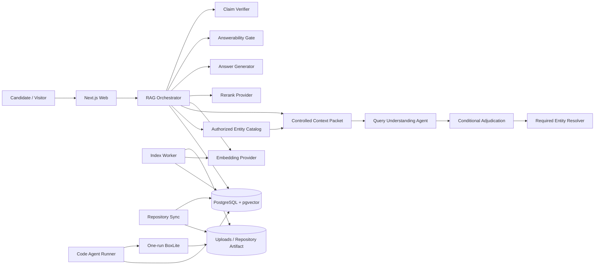
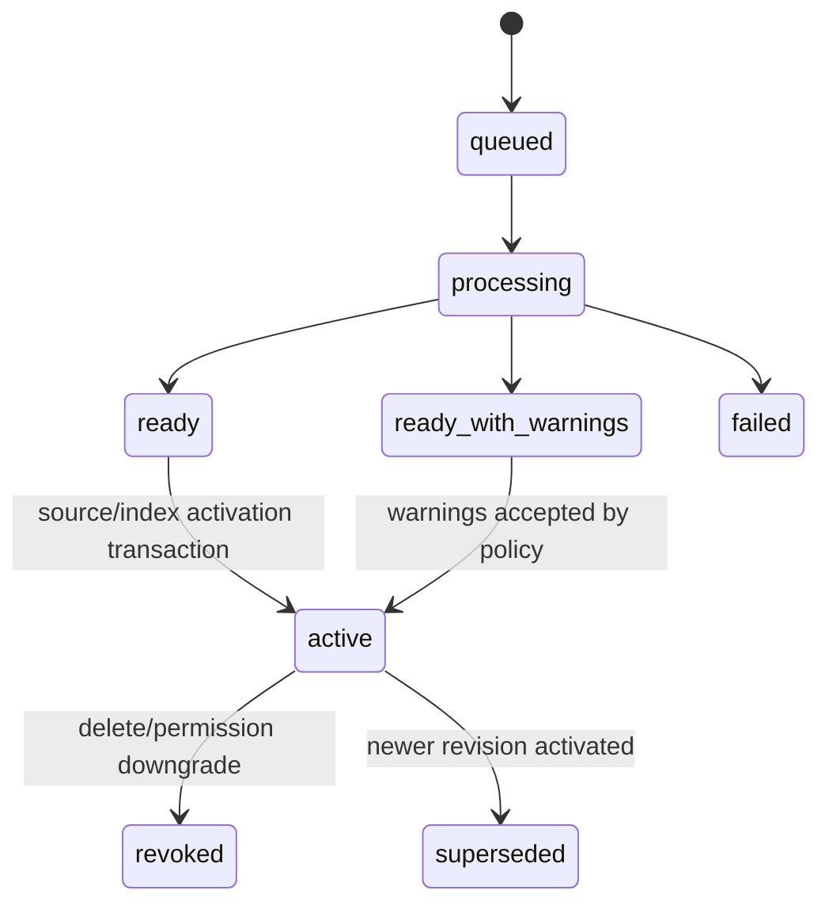
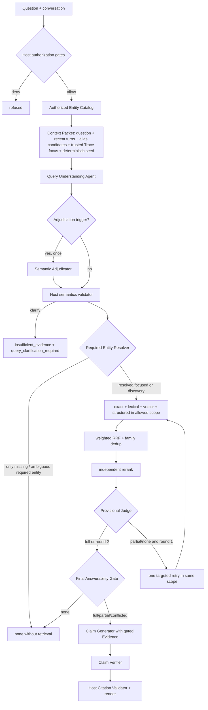

# DESIGN-005：成熟 Query-understood Entity-grounded RAG 与隔离源码分析系统设计

Boundary ID：`askme-query-understood-rag-runtime-v4`

Owner boundary：满足 [SPEC-002](../specs/SPEC-002.md) 的版本化索引、Repository 文档、混合检索、有界 Agent、Citation、权限、观测与隔离源码分析架构。

Status：`active`

当前修订 Plan：[PLAN-026](../plans/PLAN-026.md)

## 1. 目标、现状与不变量

Askme 继续使用 Next.js、PostgreSQL、Node worker、Docker Compose 和现有 Repository Artifact/Code Agent Runtime。当前 V3 已统一承载 Material、Knowledge anchor、Approved Wiki 与已批准 Repository Markdown/PDF，并完成 Authorized Entity Catalog、四路召回、RRF、Rerank、Answerability、Claim Verifier、Citation Validator、Trace 与安全重建。本修订在同一运行时把单次 Entity Extraction 升级为使用 LLM、受控上下文和条件语义裁决的 Query Understanding Agent，不建立平行 RAG 或通用 Agent Framework。

当前实现的关键差距：

- `typedMentions` 的宽泛中文正则把 `2022年到2024年，你在哪家公司任职` 中的 `你在哪家` 产成 strict organization，Catalog missing 后在 round 0 停止；该根因已由当前生产函数精确复现；
- `answerAspects` 在同一问题中把 `2022年到2024年` 拆成独立回答方面，却没有表达它是 constraint，也没有 company/job title/responsibilities 等 requested fields；
- 当前 Plan 只有 terms/entity mentions，没有 intent、subject、query mode、knowledge scope、constraints 或 requested fields；Provider 只做一次 schema completion，未利用可信 Trace focus 进行意图裁决；
- Catalog-first alias 命中会直接进入 hard scope，无法区分“Askme 是什么”的 Required Entity 与“看过 Askme 后还做过哪些项目”的 incidental Context Mention；
- `desiredEvidenceTypes` 只进入 Trace，四路 SQL 没有消费；Answerability 不读取 Query Semantics 或 Host time-overlap signal；
- V3 的 entity 评测覆盖 known/unknown/alias/context，却没有成对验证 discovery/focused、entity role、无实体 false-none、LLM/seed disagreement 和时间区间。

系统不变量：

1. Host 在检索前确定 owner、caller mode、publication、visibility、source state、active revision、active index 和 Entity Scope；任何模型不能扩大集合。
2. 原始业务数据与派生知识/检索数据分离。项目未上线，Knowledge Item organization 与 RAG index 可以全量重建；维护入口不能删除账号、原始 Material/Artifact、Repository、权限、Publication 和会话。
3. 一个查询只使用一个 active index version；Embedding model、dimension、prefix 或 chunking 不同的向量不得混合。
4. Repository 文档索引只读取成功同步的不可变 commit；原始源码仍只进入一次性只读 Deep Analysis。
5. 所有来源正文、对话历史和 Repository 指令都是不可信数据，不能改变 system contract、权限或工具。
6. Answer 生成、Claim 验证、Citation 校验与消息持久化是分离边界；任何一步失败都不能发布未验证 Claim。
7. 权限撤销立即作用于 active 检索与历史 Citation；延迟 GC 不等于延迟授权。
8. Entity identity 与 semantic relevance 分离：Catalog exact alias 决定“是谁”，Hybrid/Rerank/Answerability 决定“哪些 Evidence 能回答什么”。
9. Mention existence 与 query role 分离：LLM Agent 结合当前问题和受控上下文判断名称是 Required Entity 还是 Context Mention；Host 校验候选真实性和安全边界，任一方都不能单独凭宽泛 NER 建立硬范围。
10. Query Understanding、Entity Resolution、Retrieval 与 Answerability 各自有 bounded 状态；低置信触发一次语义裁决，不触发无界自反思或固定阈值批量拒答。

## 2. 关键选型与权衡

| 决策 | 当前选择 | 理由 | 未选择 |
| --- | --- | --- | --- |
| Vector store | 同一 PostgreSQL 18 + pgvector | 复用 tenant filter、事务、迁移、备份和运行入口 | Milvus、Qdrant、DashVector、独立向量服务 |
| Vector search | 过滤后的 exact cosine | 初始规模下 perfect recall，避免 ANN filter 漏召回 | 默认 HNSW/IVFFlat |
| Chunk | structure-first Parent–Child | 小 Child 提升召回，Parent 保留完整职业/文档上下文 | 固定字符窗口、句子碎片 |
| Fusion | weighted RRF + independent rerank | 词法/向量分数量纲不同，RRF 稳定；Rerank 独立优化回答相关性 | 直接加权原始分数、Chat LLM 排序 |
| Entity Catalog | `Knowledge Item.entities + knowledge_evidence + Repository record` 的实时授权投影 | 复用现有事实 owner，按 caller 过滤，不产生人工维护的第二知识库 | 独立通用 Knowledge Graph、向量 nearest-entity、静态全 tenant registry |
| Entity matching | canonical/alias 确定性规范化精确映射 | proper noun 身份可解释、可 hard filter、可拒答 | 用 cosine/rerank 猜实体 |
| Query understanding | LLM Agent + 受控 Context Packet + Host seed/validator + 条件二次裁决 | 理解真实意图和实体角色，同时让安全边界可解释、可降级 | 单条正则、一次宽泛 NER、把名称出现等同 hard scope |
| Query Agent | 初始解析最多一次，满足触发条件时 adjudication 最多一次 | 修复 LLM/seed 冲突和将要发生的假阳性 hard-stop，保持延迟有界 | 自由工具循环、无界 self-reflection、多数投票风暴 |
| Retrieval Agent | Host 编排的最多两轮同权限/同 Entity Scope 补检 | unsupported fields 可以定向补检，权限和延迟可控 | 无界搜索、补检扩大来源 |
| Temporal constraint | Query-time inclusive month interval + Evidence overlap annotation | 当前 Parent 保留完整任职区间，无需建立第二时间真相或重做索引 schema | endpoint exact match、仅靠字符串相等、通用时间知识图谱 |
| Answerability | Host entity gate + 一次结构化 Verifier-profile Evidence Gate | 生成前确认方面/实体/证据，冲突绑定具体 Evidence | 仅凭宽泛词命中或任意否定词、让 Generator 自行决定是否可答 |
| Claim grounding | 结构化 Claim + 独立 Verifier + Host validator | 模型不能同时担任唯一生成者和裁判 | 只靠 Prompt 要求引用 |
| Repository 文档 | approved Repository 的 Markdown/PDF 进入相同索引 | README/docs 是直接、可引用的职业项目证据 | 只检索派生 Wiki、源码全量 Embedding |
| Feedback | 离线标签 + versioned policy | 可评估、可回滚，不形成线上自修改闭环 | 点踩自动调权、自动改 Knowledge |

pgvector 官方支持 exact/approximate、cosine 与 PostgreSQL filter；本地 Compose 使用已验证存在的 `pgvector/pgvector:pg18` 镜像，并由 migration 执行 `CREATE EXTENSION IF NOT EXISTS vector` 与 `pg_trgm`。

## 3. 系统上下文



Web 负责同步命令、问答 API、Candidate/Admin Trace 和 Citation projection。Worker 负责材料/Repository 文档解析、Parent–Child、Embedding、索引激活和失败 reconcile。普通 RAG 不启动 BoxLite；只有实现级源码问题经过既有 deterministic gate 后创建 `conversation_analysis` run。

### 3.1 本地 host-native Runner 生命周期

macOS 的 BoxLite 依赖宿主 `Hypervisor.framework`，因此本地 Compose 只拥有 PostgreSQL、Web、普通 Worker 和共享 Artifact；`Code Agent Runner` 必须继续作为宿主进程运行，不能为统一进程列表而下沉到 Docker Desktop 容器。Repository 同步成功只证明 immutable Revision 与 Artifact 已保存，只有新鲜 Runner heartbeat、Artifact 可读写、BoxLite 可用且 provenance 匹配时，Repository Analysis 才能从 `pending` 获得 lease。

本地 detached 部署入口在 Compose 服务启动后，以同一调用环境执行 `nohup scripts/agent-runner.sh >> data/agent-runner/nohup.log 2>&1 &`。Runner 使用项目内 PID/lock 避免同一 checkout 重复启动，不安装 LaunchAgent、systemd unit 或其他系统服务；进程异常退出后由人工重新执行本地部署或 Runner 命令恢复。只需要 Compose 的自动化可以显式设置 `ASKME_SKIP_AGENT_RUNNER=1`，但此时 readiness 必须诚实保持 Code Agent degraded，不能宣称 Repository Analysis 可用。

Runner 与 Compose 使用同一配置优先级：当前进程环境高于项目 `.env`，项目 `.env` 高于 `~/.env`，最后使用本地默认值；宿主数据库 URL 必须由同一组 PostgreSQL 配置安全构造，不能由 Runner shell 重新实现一套不同优先级。Runner 不继承 GitHub 一次性 Token，AI Secret 不写入日志、数据库或 Artifact。启动是否成功只由 `runner/artifact/boxlite/provenance=ready` 和 `codeAgent=ready` 判断，不能用前台进程存在替代应用 readiness。

Runner 退出后 PID/lock 在正常退出路径清理；异常遗留由下次启动在确认旧 PID 不存活后精确回收。未获得 lease 的 run 保持 `pending` 等待恢复，已有过期 lease 按现有 lease/reconcile 规则重领，microVM 仍遵守 cleanup-before-terminal。Runner 停止时 Compose 与业务数据不受影响；再次执行本地部署入口即可恢复，不需要重建 Revision、重复同步仓库或删除 run。`README.md` 必须同时给出整套环境、Compose-only、手工 Runner 恢复、日志和 readiness 命令，避免只启动部分进程后把同步成功误认为分析可用。

## 4. 组件与依赖方向

| 组件 | 单一职责 |
| --- | --- |
| `RagConfig` | 解析、校验并隐藏 Provider、TopK、RRF、token budget、chunk 和 Repository 文档默认值 |
| `EmbeddingProvider` | 批量把版本化 contextual text 转为固定 1024 维向量，校验数量、维度和 finite number |
| `RerankProvider` | 对一个 query 的候选正文返回请求内相对排序，不跨请求比较 score |
| `StructureChunker` | 解析 source structure，生成 Parent、Child、原始范围、stable checksum 和 contextual prefix |
| `KnowledgeOrganizer` | 从每个 Material 的实际 Evidence 生成 Knowledge Item，并附带 typed canonical entities/aliases |
| `AuthorizedEntityCatalog` | 从当前 allowed Material 的 evidence-bound entities 与当前 allowed Repository record 投影 canonical/alias/source refs |
| `IndexCoordinator` | 创建 index/source version、调度 job、原子激活、失败保持旧 active、强撤销和 GC |
| `RepositoryDocumentCollector` | 在 immutable artifact 内按 allowlist/glob/容量发现并提取 Markdown/PDF 文本 |
| `DeterministicQueryAnalyzer` | Unicode、中文片段、CJK n-gram、时间、职业域、requested field、命名候选、精确短语与 target grammar seed；不单独决定最终意图 |
| `QueryContextBuilder` | 生成当前问题、最近受控会话、当前问题内 Catalog candidates、上一轮可信 Trace focus 和 deterministic seed 的最小 Context Packet |
| `QueryUnderstandingAgent` | 用独立 Planner Profile 输出受 schema 约束的 Query Semantics、entity role、standalone/semantic queries、terms、confidence 和 ambiguities |
| `QuerySemanticAdjudicator` | 只在 hard-stop、角色/主体冲突、低置信或真实多义时执行第二次 LLM 裁决，最多一次 |
| `QuerySemanticsValidator` | 校验 enum、question span、context focus、Required/Context 不变量、time range、requested fields 和 allowed evidence type；构造 fallback/clarify |
| `EntityResolver` | 只将 Required mention 精确映射到 Authorized Entity Catalog，输出 resolved/missing/ambiguous 与 Material/Repository scope |
| `HybridRetriever` | 在同一授权集合、Entity Scope 与 allowed evidence type 内执行 exact、lexical、vector、structured，消费 scope/fields/time 查询扩展并返回 route ranks |
| `RrfFusion` | 按配置化 weight/k 合并、stable dedup、Parent 限流和 evidence-family 标记 |
| `EvidenceJudge` | 用确定性 provisional coverage 驱动唯一补检，不再用任意否定词宣称冲突 |
| `TemporalEvidenceAnnotator` | 从最终 Parent Evidence 识别有限的年月/至今区间，对查询 time range 输出 overlap/outside/unknown，不写回业务事实 |
| `AnswerabilityGate` | 最终一次读取 Query Semantics、requested-field aspects、Entity Resolution、temporal annotations 与 Evidence，输出 supported/unsupported/conflicted aspect 和 evidence IDs；失败为系统错误 |
| `AnswerGenerator` | 输出结构化 claims/evidenceIds，不拥有授权或最终 Markdown |
| `ClaimVerifier` | 只对每条 Claim 的引用 Evidence 判断 entailment/contradiction |
| `CitationValidator` | 重新读取 active/auth/checksum，校验 Claim-Citation，Host 渲染最终 Markdown |
| `RetrievalTraceStore` | 保存安全 metadata、route count/rank/outcome/degradation，不保存向量或未授权正文 |

依赖只能从 Orchestrator 指向 Provider/Repository interface；Provider 不访问数据库，模型输出不直接写消息，Repository Collector 不修改 artifact。

## 5. 持久数据模型

### 5.1 `knowledge_items.entities` 与授权 Catalog 投影

Migration 为 `knowledge_items` 增加非空 `entities jsonb`，应用 schema 为：

```text
entities[] = {
  type: person | organization | project | product | repository | technology,
  canonicalName: string,
  aliases: string[]
}
```

Organizer 只允许从该 Knowledge Item 已声明的 `evidencePositions` 提取实体；canonical/alias 都必须在 Evidence 中出现，或属于大小写、空格、连字符、Repository namespace 等确定性格式变体。每 Item 最多 12 个 entity，每 entity 最多 8 个 alias，禁止把“项目定位”“核心功能”“平台”等通用概念作为 identity。

不创建 `rag_entities` 或 `rag_entity_links` 表。`AuthorizedEntityCatalog` 在每个 query 开始时用一组只读 SQL 投影：

- Material entity：`knowledge_items.entities → knowledge_sources → materials`，要求 Item active、Material indexed、当前 visibility 对 caller 可用；source refs 是关联 Material IDs；
- Repository entity：`repositories.display_name + canonical_url namespace/name + basename`，要求 Repository 未 disabled、visibility 对 caller 可用；source refs 是 Repository ID；
- Public caller 的查询根本不读取 private/agent-only rows，因此 missing 结果只表示“当前公开授权知识没有该实体”，不暴露 Candidate 私有 Catalog；
- projection 在同一请求内冻结，normalized alias 映射到一个或多个 entity key；一个 alias 指向多个不同 entity key 时状态为 ambiguous，不做 union 猜测。

`normalizeEntityAlias` 使用 NFKC、locale-stable lowercase、Unicode 空白折叠，并移除空格、`- _ . /` 等稳定分隔符用于匹配；原始 canonical/alias 仍保留给 Trace 和上下文。Repository entity key 使用现有 Repository ID；Material entity 默认使用请求内 `sha256(type + normalizedCanonicalName)`。若一个 Material project/repository entity 的 canonical/alias 精确命中唯一授权 Repository，它的 Material source refs 合并到该 Repository entity；命中多个 Repository 时保持 ambiguous。这样同一 OneCat 的简历与 Repository 可以统一 scope，不同 namespace 下同名 Repository 仍不会被错误合并。

### 5.2 `rag_index_versions`

全局索引配置 owner：

| 字段 | 语义 |
| --- | --- |
| `id` | UUID |
| `state` | `building | ready | active | failed | superseded` |
| `chunking_version` | StructureChunker 合同版本 |
| `embedding_provider/model/dimensions` | 默认 Qwen/`qwen3.7-text-embedding`/1024 |
| `context_prefix_version` | contextual prefix 版本 |
| `distance_metric` | `cosine` |
| `created_at/activated_at/failure_code` | 生命周期与安全错误 |

全库同一时间只有一个 active index version。新配置重建在独立 version 下完成；只有全部要求的 source versions ready 且 Golden gate 可执行时才切换 active。首次 V2 migration 不保留 V1 query path，但仍用此机制保证重建失败不会产生半成品检索。

### 5.3 `rag_source_versions`

统一表示一个可索引来源 revision：

| 字段 | 语义 |
| --- | --- |
| `owner_id` | tenant filter |
| `source_kind` | `material | approved_wiki | repository_markdown | repository_pdf` |
| `source_id` | Material、Wiki page 或 Repository id |
| `source_revision` | material checksum、projection checksum 或 `commit:path:content_hash` |
| `index_version_id` | 所属 global index version |
| `state` | `queued | processing | ready | ready_with_warnings | failed | revoked` |
| `visibility` | 入库快照，仅用于诊断；查询仍 join 当前业务 owner |
| `evidence_family_id` | 原始/派生血缘 |
| `metadata` | title、path、commit、page/line、warning 等安全 JSON |
| `parent_count/child_count/token_count` | readiness 与观测 |

逻辑 source + index version + revision 唯一。Repository 文档的 `source_id` 使用 Repository id，`source_revision` 固定 commit/path/checksum；查询必须 join `repositories.active_revision_id`，不能只信 metadata。

### 5.4 `rag_parent_chunks` 与 `rag_child_chunks`

Parent 保存原始完整上下文、token count、structure path、source range 和 checksum。Child 保存 parent id、position、原始文本、contextual text、token count、`tsvector`、trigram 可检索正文和 `vector(1024)` embedding。contextual text 由 `Source + Entities + Section + raw child` 组成：Material entity 来自当前 organization，Repository entity 来自 Repository record；它不写回原文或 Citation。所有表重复保存 `owner_id + index_version_id + source_version_id` 以允许数据库约束和先过滤后排序；foreign key 必须阻止跨 owner 关联。

Child stable key 由 `source_revision + structure_path + normalized_range + content_checksum` 计算，不以数组 position 作为跨重建身份。Knowledge Item structured route 先读取现有 `knowledge_sources/knowledge_evidence`；V2 重建后由 `knowledge_sources` 将 anchor 重新绑定到该 Material 的 active Child，不把 Candidate summary 复制成最终 Evidence。

V1 `chunks`、其 search vector 和派生 `knowledge_evidence` 可以在 V2 build 成功后清空或退出读取路径；已有 Message/Conversation 保留。无法重建的历史 V1 Citation 标记 `evidence_revoked`，不级联删除消息。

### 5.5 Trace 与反馈

`rag_query_traces` 保存 conversation/message、caller mode、policy/index version、Query Understanding safe JSON、每 route count、selected evidence IDs/scores、coverage、round count、degradation、token budget 和 latency。Safe JSON 包含 intent/subject/query mode/knowledge scope/requested fields/safe time range、entity mention role、confidence、adjudication reason、resolved/missing/ambiguous canonical name、scope Material/Repository count 与 gate reason，不保存 Context Packet、完整问题/对话、Catalog 全量、未授权实体或来源 ID 列表。表不保存 Evidence 正文、Prompt 或 vector；Candidate 只能读自己的 trace，Admin API 只返回诊断字段。

`rag_feedback` 保存 message、owner、`up | down | correction`、可选安全标签和 policy version。correction 正文按 Candidate 私有数据处理，但不进入索引或 Prompt，只有离线 eval export 显式读取。

## 6. 索引流水线



### 6.1 Material / Approved Wiki

Material 继续由现有 ingestion job 提取原始文本。Knowledge Organizer 的严格 schema 在现有 title/summary/highlights/evidencePositions 之外生成 typed entities；Host 在持久化前对 canonical/alias 做 NFKC 规范化，并验证它们出现在该 Item 选择的 Evidence，或只属于大小写、空白、连字符、namespace/basename 等允许格式变体，无法验证的 entity 使本次 organization 以稳定错误失败。`persistIngestionResult` 在同一事务写入 Knowledge Item、entities、`knowledge_sources` 与 `knowledge_evidence`。随后 RAG source worker 重新读取该 Material 的 evidence-bound entity projection，执行结构提取 → Parent/Child → `Source + Entities + Section` contextual text → Embedding batch → source version ready → activation transaction。Knowledge organization 不负责定义 chunk identity，但它拥有 Material entity metadata。

Approved Wiki 以 active projection page 和 H2/H3 section 作为结构输入；每个 section 保留实际 `[S*]` marker 与 Repository source ranges。Wiki 进入 `evidence_family` 后可参与检索，但 RRF/Verifier 优先投影到原始 Material/Repository document；只有 Wiki 的 Host-verified source 能独立引用。新的 projection 批准后，旧 projection 的 Wiki source 必须在同一协调流程中 supersede，随后按非 revoked/superseded source 重算 active index expected count；Repository 文档 readiness 只统计 Markdown/PDF，不能把 Wiki page 混入文件数。

### 6.2 Repository 文档

Repository sync 成功后，Collector 从 content-addressed artifact 读取 manifest，不从 GitHub live branch 拉取。默认 allowlist 与 Candidate include/exclude 使用 `minimatch`；默认安全 excludes 不可被反向 include。

Markdown 解析 heading/list/table/code-fence 边界，并计算源行范围。PDF 复用 `pdfjs-dist` 直接文本提取，按 page/block 记录页码；空文本或质量阈值不达标时标记 `unsupported_no_extractable_text`，不调用 OCR。单文件/页/revision token 预算超限产生 warning 和 skip reason，不截断证据。

Repository 首次处于 private 时可以预建 private index 以缩短后续切换，但检索仍不可使用；最小实现也可以在 visibility 提升时构建。实现必须保证 visibility 是 Repository 级 owner，新增/变化 path 自动继承，删除 path 使旧 source version revoked。

### 6.3 并发与幂等

复用 PostgreSQL job lease + `FOR UPDATE SKIP LOCKED`。幂等键包含 owner、source kind/id/revision、index version 和 extractor/context-prefix version；Provider retry 不创建重复 Parent/Child。一个 source version 只有 lease holder 可以提交 ready；激活事务重新检查当前业务权限与 revision。

Embedding batch 使用配置化并发、batch size、timeout 和 retry；429/5xx 可退避，dimension/schema/invalid-number 是永久失败。旧 active 只有在新 source ready 后 supersede。

`scripts/rebuild-knowledge-rag.ts` 是未上线环境的单一维护入口，默认只输出 dry-run counts，显式 `--execute --activate` 才执行：

1. 对账不存在仍持有 lease 的 Material/RAG job，并记录 users/materials/repositories/publications/conversations/messages 与派生数据计数；
2. 仅把有原始存储的现有 Material ingestion job 重置为 queued，通过现有 lease/processor 重新生成 chunks、Knowledge Item 与 entities；任一 Material 失败则停止，不激活新 index；
3. 用新的 `context_prefix_version=source-entity-context-v2` 创建 building index，收集全部当前 Materials、Approved Wiki 与 Repository documents，幂等处理到 ready；
4. 只有 source count 完整、实体回归和索引 smoke 通过后才原子激活；旧派生 index 进入 superseded，业务事实不删除；
5. 输出前后计数、new index id、source/parent/child/entity count 和稳定失败码，不打印正文或 Secret。相同命令可从当前 job/index 状态恢复。

## 7. Agentic Query Understanding 与多路检索



### 7.1 Context Packet 与确定性 seed

`retrieveRagForQuestion` 先并行加载 Authorized Entity Catalog 和同一 Conversation 最新可信 Retrieval Trace，再构造一次请求内冻结的最小 Context Packet：

```text
currentQuestion
recentConversation = 最多最近 6 条 user/assistant message，每条至多 1,200 字符，总计至多 6,000 字符
catalogCandidates = 只包含当前问题中 longest-alias scan 命中的已授权 canonical/type/text span
traceFocus = 最新 Trace 的 resolved/missing/ambiguous 安全投影与 unique/missing/ambiguous 状态
deterministicSeed = intent/scope/field/time/entity target 候选、terms 与 semantic seed
allowedEvidenceTypes
```

Public Chat 的 recentConversation 只来自当前 visitor credential 与 publication 下同一 Conversation；Candidate Preview 只来自当前 owner。Packet 不包含 Catalog 全量、未授权 entity、Evidence 正文、Prompt、SQL、Secret、source IDs 或 vector。Assistant 历史内容继续视为不可信上下文，只帮助理解指代/意图，不能成为 Evidence。

`DeterministicQueryAnalyzer` 执行 NFKC、空白/标点规范化、Latin lowercase、中文 2/3-gram、数字/版本/专名、职业域词、requested-field 问句、年月范围和有限 target grammar。它产出候选而非最终意图：

- `你/我/本人/候选人/这个人` 只产生 `subject=profile_owner` seed；
- `哪家公司/什么职位/负责什么/哪些项目` 产生 requested field，不产生 Named Entity；
- `Askme 项目的定位`、`在富途期间`、unknown CamelCase/带类型专名产生 possible required target；
- Catalog scan 只产生 identity candidate，不直接决定 role；
- time range 规范化为 inclusive month ordinal，单年为 `01..12`，非法/反向区间不进入 plan。

### 7.2 Query Understanding Agent 与语义裁决

初始 `QueryUnderstandingAgent` 复用现有独立 Planner Chat Profile，使用 temperature 0 和 strict Zod schema：

```text
intent = employment_history | project_experience | skill_profile | education_history |
         repository_knowledge | entity_detail | career_summary | general_career
subject = profile_owner | required_entity | general
queryMode = focused | discovery | clarify
knowledgeScope = employment | project | skill | education | repository | general
entityMentions[] = { text, type, source: explicit | contextual, role: required | context }
constraints = { timeRange?: { start: YYYY-MM, end: YYYY-MM } }
requestedFields[] = company | job_title | employment_period | responsibilities | achievements |
                    project_name | positioning | functions | technologies | skills | education | summary
confidence = 0..1
ambiguities[]
standaloneQuery / mustTerms / shouldTerms / semanticQueries / desiredEvidenceTypes
```

Host 只接受 explicit mention 的 normalized text 能在 currentQuestion 定位、contextual mention 与唯一可信 Trace focus 一致的输出；问词、代词、requested field、通用域名或不完整问句即使由模型输出也丢弃。Catalog candidate、deterministic candidate 与合法 LLM mention 合并为带 provenance 的候选，Agent role 决定 `required | context`，Host target grammar/可信 Trace 只允许强化明确 required，不允许把问句制造成 required。

满足任一条件时执行一次 `QuerySemanticAdjudicator`：最终候选将以 missing/ambiguous Required Entity 在检索前停止；LLM 与 deterministic/Catalog 对 subject、query mode 或 entity role 冲突；confidence `<0.75`；requested fields 为空；或存在 context/required 两种合理解释。裁决输入只包含 Context Packet、初始输出、冲突清单和 Host 不变量，输出同一 schema 加 `decisionReasonCode`。裁决最多一次；不访问工具、不读取 Evidence、不形成循环。

Host finalizer 按以下优先级生成生产 `RagQueryPlan`：可信当前问题/Trace span 与授权不变量 → adjudicated semantics → initial semantics → deterministic fallback。两次 LLM 都失败时，明确 target grammar 或唯一可信 contextual focus 使用 focused，其余使用 discovery；真实多个合理主体且答案会变化时使用 clarify。Clarify 在 round 0 返回 outcome `insufficient_evidence`、reason `query_clarification_required` 和最小澄清文案，不调用 Embedding、Router、Deep 或 Answer Generator。

Requested Fields 按原问题顺序映射为 `answerAspects[]`；time range、subject 和 scope 只作为 constraint。每个 field 使用 Host 稳定 label，Provider 不能生成未知 aspect。`scope + fields + time` 的受控中英文 expansion 只加入 should/semantic query，不加入 Required Entity 或 must term。

### 7.3 Required Entity Resolution 与 Scope

`resolveAuthorizedEntities` 只消费 `role=required` 的 mentions：

1. `queryMode=discovery` 且没有 Required Entity 时返回 `no_required_entity`，`scope=null`，不得停止检索；Context Mention 保留在 safe semantics/Trace，不进入硬范围；
2. Required mention 按 normalized alias 映射为 `resolved | missing | ambiguous | soft`；technology/other 仍为 soft term；
3. resolved strict entities 合并 Material/Repository IDs 形成 union Entity Scope；多实体比较可读取各自来源，不能读取其他实体来源；
4. 唯一 required strict mention missing/ambiguous 时，只有经过 adjudication 或无需 adjudication 的高确定 target 才在 round 0 failed-close；resolved + missing 保留 resolved Scope 并把 missing 绑定到缺口，coverage 上限 partial；
5. contextual reference 仍只信任同一 Conversation 最新 Trace；零 focus 为 missing，多 focus 或 resolved 与 missing/ambiguous 并存为 ambiguous，初始 Agent 猜测不能覆盖 Host；
6. Catalog alias 作为 context 时不进入 resolver。例如“看过 Askme 后还做过哪些项目”保持 discovery；“Askme 的定位”才以 Askme focused。

Entity Resolution 随请求传递，不写回 Catalog。`stopBeforeRetrieval=true` 或 clarify 时两个 consumer 记录 route audit 后直接形成确定性结果，不调用 Router；因此 missing/ambiguous/clarify 不会被改写成 refused 或错误 Deep。Deep fallback 只接受这里唯一 resolved 的 required Repository ID。

### 7.4 Route SQL

- exact：规范化正文/标题/实体字段的 phrase equality、substring 和 stable alias；
- lexical：`plainto_tsquery`/`to_tsquery` 的安全 lexeme，加 `pg_trgm` similarity/ILIKE probe；
- vector：把最多两个 semantic query 分别 Embedding，join 当前 active source/index，按 `<=>` cosine distance 排序；
- structured：Knowledge title/summary/type、Material/Repository metadata 和 `knowledge_sources` 关系，只作为 anchor rank。

每路先应用 owner、allowed visibility、status、active revision、active index、revoked、allowed evidence type 和 Entity Scope 条件。Scope 为 null 时表示 discovery 或没有 Required Entity；Scope 非空时 Material source 必须属于 `materialIds`，Repository Markdown/PDF/Wiki 必须属于 `repositoryIds`。`material|knowledge` 映射 Material source，`approved_wiki` 映射 Approved Wiki，`repository_document` 映射 Repository Markdown/PDF；Host 按 knowledge scope 计算允许集合，再与 Agent desired types 取交集，空交集使用 Host 集合而不是扩大来源。四 Route 共用同一 `eligible` CTE 参数，任何 Route 或 Provider 都不能绕过。默认 TopK/weight 为 exact `20/1.5`、lexical `30/1.0`、vector `30/1.0`、structured `20/1.2`。RRF 默认 `k=60`，按 stable Child 合并；同 Parent 最多三个 Child，同 evidence family 不重复增信。

### 7.5 Rerank、补检与 Answerability

Rerank adapter 按独立 Base URL 和 `provider protocol` 调用 `qwen3-rerank`：`dashscope-compatible` 使用 Workspace 专属 `compatible-api/v1/reranks`、顶层 `results` 与固定问答检索 `instruct`，`cohere-compatible` 使用 `/reranks` 且不发送 DashScope 专属字段。请求包含 query、candidate contextual text 和 `top_n`。Host 只接受输入 index 范围内的唯一结果和 `0..1` finite score；score 仅在当前请求内使用。

Rerank 未配置、超时或失败时使用 RRF，Trace 标记 degradation，Provisional Judge 提高 full 阈值。Provisional Judge 只根据 entity consistency、词/方面 coverage、route/rerank 和 source quality判断是否需要一次补检；它不再扫描任意否定词产生 `conflicted`。只有 round 1 partial/none 才构造 unsupported-aspect retry plan，且 retry 复用完全相同的 Entity Scope；round 2 无论结果如何都停止。

最后一轮后，`TemporalEvidenceAnnotator` 在 time-constrained query 中从每个候选的 `parentContent` 识别有限格式（`YYYY.MM/YYYY-MM/YYYY年MM月`、区间分隔、`至今/present`），转换为 month ordinal 并标记 `overlap | outside | unknown`。它不写数据库、不把解析结果当业务真相；outside Evidence 不能单独支持该时间范围，unknown 仍交给 Answerability 从原文判断，避免 parser 漏格式造成 false-none。

`assessRagAnswerability` 使用现有 Verifier Chat Profile 完成一次结构化调用，输入仅包含当前问题、安全 Query Semantics、Host requested-field `answerAspects`、Entity Resolution、temporal annotations 和最终 Evidence Pack。Focused query 必须满足 Required Entity identity；Discovery query 允许 Evidence 中的 company/project 填充 requested field；Context Mention 不得成为错误主体或排除其他证据。输出：

```text
aspects[] = {
  aspectId,
  status: supported | unsupported | conflicted,
  evidenceIds[]
}
```

Host 校验所有 aspect/evidence ID 属于当前输入。Time-constrained employment aspect 不能只由 `outside` Evidence 支持；若模型只引用 outside IDs，Host 将该 aspect 降为 unsupported，`unknown` 仍需由模型从原文证明。`conflicted` 至少需要同一 aspect 的两个不同 evidence family；否则降为 supported/unsupported。所有 aspect unsupported 时为 none；部分 supported 为 partial；全部 supported 为 full；任一合法 conflicted 为 conflicted。Gate 只把它引用的 Evidence 交给 Answer Generator，减少“相关但不可回答”的上下文污染。Gate 超时、schema invalid 或引用越界返回 `AI_ANSWERABILITY_FAILED`，message outcome 为 failed，绝不伪装成 none。

## 8. Evidence Pack、Claim 与 Citation

Evidence Pack Builder 先按 Rerank/Parent/family 选择，再计算 token。配置的 `200,000` 是 hard ceiling；effective ceiling 必须扣除 system、conversation、output reserve 和 safety margin。Builder 以 provisional full coverage 提前停止，不为了填满预算加入弱 Evidence；Final Answerability Gate 再把 Pack 收窄为直接支持当前 aspects 的 Evidence。

Answer Generator 输出：

```text
coverage
claims[] = { claimId, aspectId, text, evidenceIds[] }
unsupportedAspectIds[]
```

Orchestrator 在请求开始时从 Host 时钟冻结一次 `currentDate: YYYY-MM-DD`，与安全 Query Semantics、requested-field `answerAspects`、resolved/missing required entity 摘要和 temporal annotations 一起作为受信任 system context 传给 Answer Generator。Prompt 明确区分 focused 与 discovery：前者禁止把 Evidence canonical entity 重命名为另一个 required entity，后者允许从 Evidence 填充 company/project 等未知字段但不能把 Context Mention冒充主体。Generator 不读取 Catalog 全量或未授权实体。`currentDate` 只允许参与工作年限等相对时间计算，不能替代职业 Evidence；同一请求的检索、生成、验证和持久化不得重新取时钟而产生跨日漂移。对于明确询问工作年限的单方面问题，Host renderer 从已通过 Verifier 的 Claim 提取带“起 / since / from”语义的职业起点，并以 `currentDate` 计算约年数或年月；无法得到已验证起点时仍使用普通已验证 Claim，不从原始 Evidence 猜测日期。该派生文本复用 Claim 的 Citation，既覆盖 Provider 遗漏时长，也覆盖 Provider 使用旧年份的情况。

Host 在 Verifier 前重新加载 evidence IDs 并核对 owner、active source/index、visibility、checksum。Claim Verifier 每次只接收一个或一小组 Claim 及其 cited subset，输出 entailed/partial/unsupported/contradicted 和可选 narrowed text。一次 repair 只能删除或收窄 Claim，不能新增 evidence ID。

Citation Validator 确认每条最终 Claim 至少一个 entailed Evidence；Material 使用 Child range/checksum，Repository Markdown 使用 commit/path/lines/checksum，PDF 使用 commit/path/page/checksum，Wiki marker 必须映射当前 Approved Projection 的 Host-verified source。Host 拒绝未知 `aspectId`，在 Verifier 后重新汇总每个 answer aspect，并把没有有效 Claim 的方面转为显式缺口。最终 Claim 先执行规范化完全重复与同方面高重叠检查；同方面安全可判定的重复只保留信息完整的一条，无法安全合并的高重叠返回稳定质量错误。跨方面只拒绝规范化后完全相同的 Claim，允许职责与成果等方面保留必要的公司或项目上下文。Host 按 answer aspect 原顺序和用户语言渲染 Markdown 与 Citation DTO，模型不能直接决定章节顺序或内部 URL。

互相冲突的 Evidence 由 Final Answerability Gate 绑定到具体 aspect 和不同 evidence family 后标记 `conflicted`；Answer 只能说明冲突和各自来源，不能选择“看起来更新”的一方。`partial` 只渲染已支持方面并列出缺口，missing entity 使用用户已经提供的名称生成安全缺口，不列举 Catalog 其他实体。Answerability/Answer/Verifier/Validator failure 使用独立 stable error，不返回 insufficient fallback。

## 9. Provider 与配置

`RuntimeConfig` 新增独立配置：

- `embedding`: API key/base URL/model/dimensions/timeout/retry/batch/concurrency；
- `rerank`: API key/base URL/model/provider protocol/timeout/retry/topN；
- `planner` 与 `verifier`: Chat Profile；`planner` 同时承载初始 Query Understanding 和条件 adjudication，但两次调用独立计量并使用不同 system contract；
- `retrieval`: route TopK、weights、RRF k、Parent/Child limit、round limit；
- `evidence`: max tokens `200000`、output reserve、safety margin；
- `chunking`: child/parent targets、hard max、min、overlap；
- `repositoryDocuments`: include/exclude、Markdown/PDF/revision limits。

环境 allowlist 包含用户已配置的 `ASKME_EMBEDDING_MODEL_API_KEY`、`ASKME_EMBEDDING_MODEL_API_BASE_URL`、`ASKME_EMBEDDING_MODEL`，默认 dimensions 为 1024。Rerank 使用 `ASKME_RERANK_MODEL_API_KEY`、`ASKME_RERANK_MODEL_API_BASE_URL`、`ASKME_RERANK_MODEL=qwen3-rerank` 和 `ASKME_RERANK_PROVIDER_PROTOCOL`，不从 Embedding Secret 静默派生；部署者可以显式把二者设置为相同 key。

Embedding/Rerank adapter 使用最小 fetch HTTP contract，不强行把非 Chat endpoint 塞进现有 `openai` Chat adapter。Provider 原始错误正文不进入数据库/UI；只记录 request id（若安全）、latency、token/数量和 stable code。

## 10. 权限、强撤销与安全

检索 SQL 必须从当前业务 owner join：Material 要求 `status=indexed` 和 allowed visibility；Repository 文档要求 Repository 未 disabled、active revision 精确匹配且 visibility allowed；Wiki 要求 active approved projection。授权 join 后再应用 Entity Scope，scope 只能减少 eligible rows。`rag_source_versions.visibility` 只用于审计，不作为授权事实源。

Repository 设置以整个 Repository 为唯一发布 owner。visibility 从 private 提升后全部白名单文档可用；后续新增/修改自动继承。降低 visibility、删除、publication revoke 或账号停用时，事务先更新业务状态并使相关 source versions revoked，再返回成功；Embedding row 的物理删除异步执行。

历史消息读取先验证其 Evidence 仍授权。Repository 权限降低时，引用该 Repository 且超出新可见性范围的回答在同一事务中持久标记失效；失效 Citation 投影为 revoked，后续恢复 visibility 或重建 source 不清除该标记。回答依赖失效 Evidence 时状态投影 `evidence_revoked`，只能由新问题生成新回答。不复制私有正文到消息或 Trace，避免撤销后仍可从 snapshot 读取。

Prompt Injection 防护使用结构化消息边界、固定 system contract、Evidence delimiter 和工具为空的 Chat calls。材料中的“指令”不经过任何动态注册路径。Query Understanding Agent/Adjudicator 不读取 Evidence 或 Catalog 全量，历史对话标为 untrusted context；Rerank 无工具，Generator/Verifier 只接收 Host 选择的正文；所有输出经过 schema 与 allowlist 校验。

## 11. Retrieval Trace、状态与反馈

每个 query 建立 trace id，并在相同 owner 下追加 stage metadata。安全投影包含 policy/index/commit、intent/subject/query mode/knowledge scope/requested fields/safe time range、entity mention role、initial confidence、是否 adjudicated 与 decision reason、resolved/missing/ambiguous canonical name、scope source count、gate reason、route counts、selected evidence ids/title/score、temporal match counts、provisional/final coverage、round、budget、degradation、filter/warning 和 stage latency。Trace 不保存原始 Context Packet、完整问题/对话、Catalog 全量、未授权 entity/source IDs、Evidence 正文或 adjudication 自由文本。Candidate 可以展开自己的 trace；Admin 默认只看聚合/安全 metadata，只有通过既有治理授权进入 tenant 诊断时才看相同安全投影。

Repository 页面把 sync 与 index 分栏：sync state、requested/full SHA、artifact ready；index state、active commit、files indexed/skipped、warning/error、last activated。Material 页面同样区分 extracted/indexing/ready/failed。

Feedback API 只写 `rag_feedback`，不调用 Provider、不更新 policy、不创建 Knowledge Item。离线 eval runner 可以导出匿名 case 候选，但真实用户问题和材料默认不进入仓库 fixture。

## 12. 失败、恢复与观测

| 失败 | 行为 | 恢复 |
| --- | --- | --- |
| Embedding 未配置/失败 | Query 降级 lexical；新 source index failed 或 retry | 配置恢复后重跑 source/index version |
| Rerank 未配置/失败 | RRF + strict Judge | 下次请求自动重试 Provider |
| Query Agent initial invalid | 若触发条件成立则 adjudication，否则 deterministic semantics | Trace 标记 `query_understanding_fallback` |
| Query adjudication invalid | deterministic focused/discovery/clarify fallback | Trace 标记 `query_adjudication_fallback`，不无界重试 |
| 真正意图/主体多义 | round 0 `insufficient_evidence` + `query_clarification_required` | 用户回答最小澄清问题后新 query |
| Required Entity missing/ambiguous | 经必要 adjudication 后跳过 Embedding/Retrieval，返回安全 none/partial 缺口 | 补充或授权来源、消除 alias 歧义后新问题重试 |
| Answerability invalid | message failed，不伪装 none | Provider 恢复后新问题重试 |
| Answer/Verifier invalid | message failed，不伪装 none | 用户安全重试，新 trace |
| Citation invalid/revoked | 不提交最终回答 | 重新检索；不能复用旧 Evidence |
| Repository file unsupported | ready_with_warnings + skip reason | 调整 glob/limit 或后续 OCR 版本 |
| Worker crash | lease expiry 后幂等恢复 | 旧 active 继续服务 |
| 新 global index failed | 保持旧 active index | 修复后新 version 重建 |

指标至少包含 source indexing latency/count/failure、Embedding batch latency/tokens/errors、query mode/intent/scope distribution、adjudication rate/reason/latency、entity role false-positive/false-negative eval、entity resolved/missing/ambiguous distribution、clarification rate、preflight retrieval-skip count、scope source count、route hit count/latency、exact vector P50/P95、Rerank/Answerability latency/errors、temporal overlap/outside/unknown、provisional/final coverage distribution、discovery false-none eval、Citation failure、revocation filter 和 actual evidence tokens。日志只使用 id、state、count、duration、stable code，不打印 question、conversation、正文、vector、Prompt 或 Secret。

HNSW gate 由 active vector count 和 exact query P95 触发离线评估；实现不自动建 HNSW。达到 `100,000` 或 P95 `>100 ms` 后，只有 Recall@30 不低于 exact 门禁时才能通过新 migration/policy 启用。

## 13. Query-understood RAG V4 直接切换与重建

1. Query Semantics、entity role、adjudication 和 temporal annotation 都是请求/Trace JSON 内的派生状态，不新增业务表或第二事实源；当前消息 outcome 保持 `answered | refused | insufficient_evidence`，clarify 使用稳定 reason。
2. `retrieval_policy_version` 直接切换为 `query-understood-rag-v4`；旧 V3 Query/Entity Policy 不作为兼容 fallback 或 feature flag。Provider 全失败只回到同版本 deterministic semantics。
3. `context_prefix_version=source-entity-context-v2`、Embedding model/dimension 和 chunk schema 不变，因此 Query policy 本身不要求重新 Embedding。PLAN-026 仍执行一次全量 Knowledge/RAG 重建，用于清除潜在旧 organization 漂移并在干净派生数据上完成真实验收，不把重建伪装成代码必要 migration。
4. 通过 `rebuild-knowledge-rag --execute --activate` 重新组织全部现有 Materials，并重建 Material/Wiki/Repository 派生索引；新 index 完整、Query Semantics/Entity 成对回归和索引 smoke 通过后原子激活，旧 index 进入 superseded。
5. 应用或重建失败可以幂等重跑；旧 active 在新版本激活前继续服务。维护入口不得删除账号、原始 Material/Artifact、Repository、权限、Publication 或会话，已 superseded index 只用于诊断/受控清理。

本地真实部署必须记录前后 users/materials/repositories/publications/conversations/messages 数量并保持不变；Knowledge Item、legacy chunks、rag source/parent/child/vector 数量必须按重建结果诚实变化和对账。

## 14. Golden Dataset 与验证

仓库 fixture 使用至少三名虚构 Candidate，材料、Entity Catalog 与 Evidence ID 稳定。既有 120 case、至少 12 个 entity-grounding case 加至少 18 个 Query Semantics 成对 case，以 JSON/JSONL 保存 question、conversation turns、trusted trace focus、deterministic/catalog candidates、expected intent/subject/mode/scope/entity role/constraints/requested fields、是否 adjudicate、entity resolution/scope、coverage/outcome、required/forbidden evidence IDs、可支持目标 Claim 的 acceptable Citation IDs 和 tags；`requiredEvidenceIds` 只约束必须召回的 canonical evidence，不能误作唯一合法 Citation。Eval runner 分三层：

1. 纯函数层调用生产 `DeterministicQueryAnalyzer`、Host Query Semantics validator/fallback、Required Entity Resolver、time overlap、RRF、Evidence Pack/Coverage 与 permission filter；不使用 tag/关键词直接生成预测；
2. Query Agent 层使用合成 Context Packet 调用真实初始 Agent 与按条件触发的 adjudication，成对校验 focused/discovery/clarify、required/context role、subject、fields、time 和 fallback；
3. `eval-rag-runtime.ts` 在隔离真实 PostgreSQL fixture 上调用真实 Query Agent、Embedding、四 Route SQL、Rerank、Final Answerability、Answer、Claim Verifier 与 Citation Validator，运行至少 18 个 discovery/focused/clarify/known/unknown/incidental/context/permission/provider-failure case；结束删除 fixture owner 与 artifact。

Provider 非确定输出不以逐字答案为 gold；gold 约束结构化 semantics/entity role、outcome、Claim key facts 和 Evidence IDs。Approved Query Semantics 集的 required-role 假阳性、Required Entity 漏识别、discovery false-none 和跨实体替代必须为 0；开放语言不声称数学上绝对零错误，任何新失败先进入可复现 eval 再调整 Agent/Host policy。Prompt Injection、conflict、duplicate family、Repository commit 切换、强撤销和所有降级模式必须有 case。

自动化门禁包括 unit、PostgreSQL integration、migration-from-current-data、provider contract、worker lease、security、API 和 full build。真实验收使用当前本地 Candidate/Public Agent：两端都验证 `2022–2024 在哪家公司、职位和职责`、`做过哪些项目` 等 discovery 问题正确回答；`Askme 是什么` focused、未知实体 failed-close、incidental Askme 不错误 hard scope、多轮指代/clarify、Citation/Trace/会话持久化以及无 Console/Network 错误。

## 15. 隔离源码分析保留边界

现有 `src/server/code-agent`、`analysis_runs`、BoxLite microVM、Pi guest 只读工具、SSE 和 Host Citation 校验继续服务 `deep`。本修订只改变 Repository 选择前提：Query Understanding 最终为 focused、Required Entity Resolver 唯一解析到一个授权 Repository 且 Host Entity Gate 允许继续后，Router 才能在文档 RAG 后提出 deep 建议；Context Mention、discovery、clarify 或 unknown required entity 均不能排队。最终 Citation 继续进入统一授权投影，Trace 记录 route transition。

Deep run 仍绑定一个 owner、Repository、完整 SHA 和 artifact checksum；每 run 新 microVM，不挂载 Host 工作树，不持有 GitHub Token，不执行 Shell/build/test/install/network。中间 reasoning/tool output 不持久化，cleanup 成功后才提交最终回答；失败不回退成伪成功 RAG。

## 16. 外部选型依据

- pgvector 官方支持 PostgreSQL 内 exact/approximate nearest-neighbor、cosine distance、filter、FTS + RRF/cross-encoder 混合检索；当前实现初始只用 exact。
- 阿里云百炼官方说明 `qwen3.7-text-embedding` 支持 256–2560 自定义维度和多语言长文本，当前实现固定 1024 维避免同索引混维度。
- 阿里云百炼官方 `qwen3-rerank` 接口返回输入 document index 与请求内 `relevance_score`，因此 adapter 只用它排序当前候选，不把分数当跨请求阈值。
