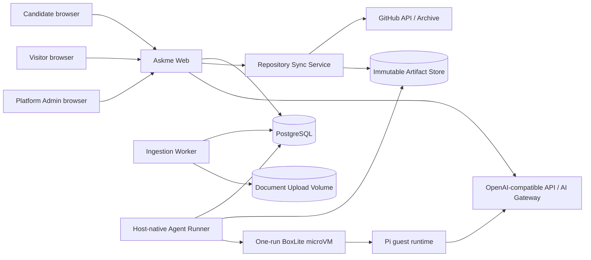
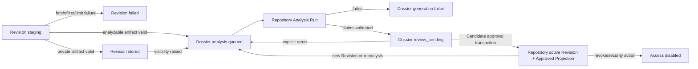
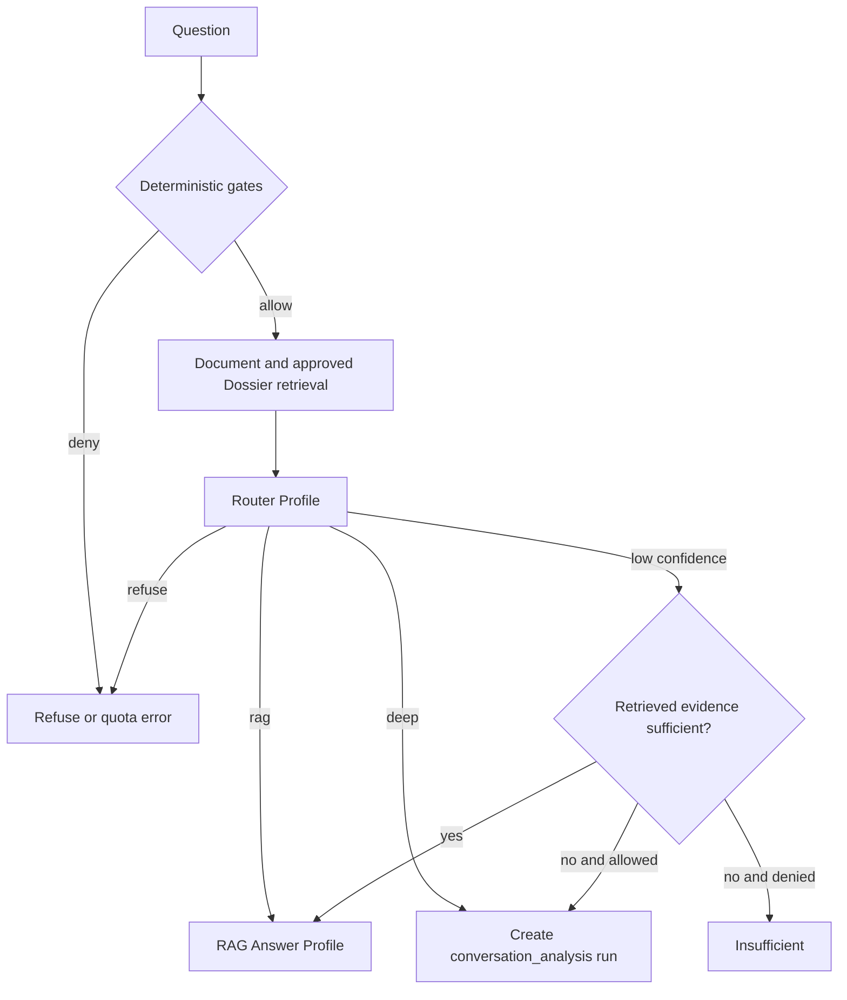
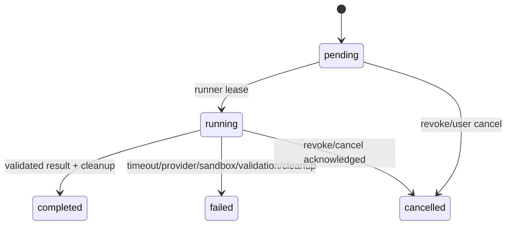

# DESIGN-005：代码仓库知识与 Pi + BoxLite 深度分析 V1 系统设计

Boundary ID：`askme-repository-code-agent-runtime-v1`

Owner boundary：满足 [SPEC-002](../specs/SPEC-002.md) 的 Repository、Dossier、路由、隔离运行、异步事件、成本与部署架构。

Status：`active`

唯一父 Plan：[PLAN-013](../plans/PLAN-013.md)

批准依据：[REVIEW-055](../reviews/REVIEW-055.md)、[REVIEW-056](../reviews/REVIEW-056.md)

## 1. 目标、现状与不变量

本设计在 Askme 现有 Next.js、PostgreSQL、Node worker 和 Docker Compose 基础上增加独立 Repository 领域和 Host-native Code Agent Runner。代码仓库在同步时生成可审核 Dossier，普通问答使用文档与 Approved Dossier，深度问答才在一次性 BoxLite microVM 中运行 Pi 并读取不可变源码。

本设计定向替代 [DESIGN-001](DESIGN-001.md) 中的 GitHub External Source Adapter、GitHub 文本快照/Chunk、DeepSeek 专用 adapter 与同步 Chat-only 回答边界；文件、Website、Notion、PostgreSQL 文档全文检索、身份、发布、普通 worker、上传 volume 和 Admin 架构继续有效。

系统不变量：

1. Repository 与 Material 是两个独立聚合；源码正文不进入 `materials`、`chunks`、Knowledge Item 或向量索引。
2. 一个 run 只绑定一个 owner、Repository、完整 SHA 和 artifact checksum；Agent 不读取 live branch、宿主工作树或其他 revision。
3. Candidate/Public 授权由 Host 确定性代码执行；Router、Pi、Skill 和模型都不能扩大权限。
4. 每个深度 run 使用新的 BoxLite microVM，guest 不挂载宿主目录、不接收 GitHub credential、不跨 run 保留状态。
5. Repository 中的指令文件只作为数据；Pi 只加载 Askme 产品代码内显式注册的 Skill 和工具。
6. Dossier Generated Version、Candidate Approved Projection、会话答案和数据库运行状态各有唯一 owner，不互相回写形成循环知识源。
7. 数据库是 job/run 状态与 SSE 恢复的唯一事实源；`LISTEN/NOTIFY` 只用于唤醒，不能替代持久状态。
8. 任何源码 Citation 在返回前都由 Host 重新验证 SHA、path、line、hash、过滤与 visibility。

## 2. 关键选型与权衡

| 决策 | V1 选择 | 主要理由 | 放弃或延迟 |
| --- | --- | --- | --- |
| 源码知识 | 同步时生成结构化 Dossier，实时深度问题读取原始 artifact | 小型个人知识库无需复制源码索引；Dossier 可审核，深度问题保持源码新鲜度 | 源码 RAG、embedding、AST、call graph、语言适配器 |
| Agent harness | Pi 在 BoxLite guest 内按 run 启动 | 工具、上下文、临时文件和模型调用处于同一隔离边界 | Pi 常驻 Host、每用户常驻 Agent |
| 隔离粒度 | 每个 Repository/Conversation Analysis Run 一个新 microVM | tenant、问题和凭证不跨 run；生命周期可确定清理 | tenant warm pool、session-long sandbox |
| 队列 | PostgreSQL lease + `FOR UPDATE SKIP LOCKED` | 复用当前事实源、事务、审计与恢复能力 | Redis、Kafka、独立 orchestrator |
| 浏览器更新 | HTTP command + PostgreSQL `LISTEN/NOTIFY` + SSE | 单向状态流足够，断线可由 DB 快照恢复 | 短轮询、WebSocket、独立消息总线 |
| 业务 LLM 客户端 | 官方 `openai` Node SDK 后置 Askme adapter | OpenAI-compatible Chat Completions 生态稳定、provider 中立 | 自定义 DeepSeek 客户端、Responses-only 合同 |
| Pi 模型调用 | guest 内 `pi-ai` / ModelRuntime 直连外部 endpoint | 不重复实现 Pi provider/tool loop，Askme 不代理 prompt | Host LLM Gateway |
| Artifact | Host content-addressed immutable `.tar.zst` store | 简单、可校验、适合单机 V1，且可抽象为对象存储接口 | PostgreSQL blob、直接 host mount |
| 管理能力 | 确定性 Admin API/controller/worker | 状态治理不需要非确定 Agent | System Operations Agent |

## 3. 系统上下文与部署边界



Docker Compose 继续运行 `db`、`migrate`、`web` 和文档 `worker`。`agent-runner` 作为宿主原生服务运行，因为 BoxLite 需要 macOS Hypervisor.framework 或 Linux KVM，不能假设普通 Compose 容器具有嵌套虚拟化权限。V1 runner 直接从 PostgreSQL lease `analysis_runs`，不暴露公共管理 HTTP API。

开发机与本地交付支持 macOS Hypervisor.framework；Linux 部署要求可用 `/dev/kvm`。BoxLite 最低锁定到包含只读挂载安全修复的 `0.9.0`，实现阶段应锁定精确版本并验证实际平台能力。Repository/Deep Analysis 未配置或 runner 不可用时，Web 与普通文档问答仍可启动，但相关能力显示明确 unavailable/degraded。

V1 只支持一个 Web 实例。该实例持有一条 PostgreSQL `LISTEN` 连接并向本进程 SSE consumer 扇出；未来多 Web 实例可以让每个实例各自 LISTEN，或在实际规模需要时引入共享事件服务，不在 V1 预建。

## 4. 组件职责与源码组织

| 组件 | 单一职责 |
| --- | --- |
| Repository Service | owner 授权、Repository CRUD、visibility、同步请求、active Revision/Dossier 投影 |
| GitHub Sync Adapter | 校验 GitHub.com URL/ref，使用请求内 Token 解析 SHA、下载 archive，随后立即丢弃 Token |
| Artifact Service | 安全解压、过滤、限额、checksum、`.tar.zst` 持久化、引用计数与 GC |
| Document Retrieval | 只检索文件/Website/Notion、Knowledge Item 与 Approved Dossier，不读取源码正文 |
| Question Router | 确定性门禁后的 `rag/deep/refuse` 分类，不拥有权限 |
| Business AI Adapter | 使用官方 `openai` SDK 承担 Router 与普通回答，统一 schema、超时、重试和错误 |
| Agent Runner | lease run、创建/销毁 microVM、注入运行配置、复制 artifact、预算与最终校验 |
| Pi Guest Runtime | 在 guest 内加载一个产品 Skill，执行多轮只读搜索/阅读与模型决策 |
| Analysis Event Bridge | 事务更新 run/version 后 `NOTIFY`，SSE 连接按授权发送快照和最小状态事件 |
| Admin Controller | 配额、禁用、重跑、取消与运行健康治理；不分析代码 |

Pi 是 Askme 的业务运行时依赖，不是 Askme 源码开发 Harness。业务配置、contracts、guest 和 Skill 全部放在 `src` 下，不创建项目根 `.pi`，也不从 `.agents/skills` 加载业务能力。建议目录：

```text
src/
├── agent-runner.ts
└── server/
    └── code-agent/
        ├── contracts/                 run、result、citation、budget schema
        ├── host/                      lease、scheduler、validation、reconcile
        ├── sandbox/                   BoxLite adapter、image、copy、cleanup
        ├── guest/                     Pi bootstrap、readonly tool implementations
        ├── skills/
        │   ├── repository-analysis/SKILL.md
        │   └── code-question-answering/SKILL.md
        └── resources/
            ├── model-profiles/
            └── system-prompts/
```

`.agents/skills` 继续只服务 Askme 开发治理。产品 Skill 通过自定义 resource loader 按 run purpose 显式选择，不启用 Pi 默认目录发现。Repository 内的 `AGENTS.md`、`.agents`、`.pi` 或相似文件可以被 `read/grep/find` 观察，但没有注册或执行路径。

## 5. 数据与事实 owner

### 5.1 Repository 与 Revision

| 实体 | 关键字段 |
| --- | --- |
| `repositories` | owner、provider=`github`、canonical URL、display name、visibility、public deep-analysis flag、active revision/projection、created/updated |
| `repository_revisions` | repository、requested ref、full SHA、archive/artifact checksum、filter version、artifact key、size/file counts、state、failure code、timestamps |
| `repository_sync_jobs` | repository/revision、state、lease owner/expiry、attempt、safe error、created/finished |
| `repository_artifacts` | content key、checksum、compressed/extracted size、file count、retention/ref count、GC eligibility |

`repositories.active_revision_id` 与 `active_projection_id` 在 Candidate 批准事务中同时更新。Revision 唯一键至少包含 repository + full SHA + filter fingerprint；同一输入重复同步复用 artifact，但不能复用另一个 owner 的授权记录。

### 5.2 Dossier

| 实体 | 关键字段 |
| --- | --- |
| `repository_dossiers` | revision、generated version、state、coverage、image/Skill/prompt/profile/model provenance、outdated reason |
| `repository_dossier_claims` | dossier、category、title、statement Markdown、default visibility、sort order |
| `repository_dossier_citations` | claim、path、line start/end、content hash |
| `repository_dossier_projections` | dossier、state、approved by/at、superseded/disabled at |
| `repository_dossier_projection_claims` | projection、generated claim、edited statement、effective visibility、hidden flag |

Generated tables 只追加，不更新事实正文和 Citation。Candidate 编辑只写 projection claim；批准前校验每个未隐藏事实仍绑定 generated claim 和有效 Citation。公共 EvidenceProvider 只读取 active Approved Projection，并按当前 visibility 生成与文档 Citation 相同的外部回答接口。

### 5.3 Analysis Run 与消息

`analysis_runs` 统一承载两种 purpose：

- `repository_analysis`：同步触发，低优先级，结果写新的 Generated Dossier；
- `conversation_analysis`：问题触发，高优先级，结果只写会话最终消息与 Citation。

关键字段包括 owner、purpose、repository/revision/artifact、conversation/message、state、outcome、priority、version、lease、cancel reason、budget snapshot、usage、image digest、Skill hash、prompt version、profile、actual model、safe error code、created/started/finished/cleanup timestamps。`analysis_run_events` 只在确有审计/调试需要时保存安全状态转换，不保存 reasoning 或 tool output；SSE 读取 `analysis_runs` 当前行即可恢复。

幂等键由 Host 计算并受数据库唯一约束：

- sync 使用 owner + canonical repository + full SHA + filter fingerprint，阻止同一显式同步请求重复创建 artifact；
- Repository Analysis 使用 revision artifact checksum + filter fingerprint + image digest + Skill hash + prompt version + Profile fingerprint + `analysis_generation`。普通重试保持 generation 不变并复用 run，Candidate/Admin 显式重跑先递增 generation，因此同一环境的误重试可去重而主动重跑仍会创建新 Generated Version；
- Conversation Analysis 使用 conversation + `clientMessageId` + repository revision + route/policy version，避免浏览器重试重复启动 microVM 或保存两条回答。

Profile fingerprint 包含模型名、thinking/reasoning、token/timeout/tool budgets 与 provider compatibility；最终 provenance 仍保存上游实际返回的 model。任何幂等命中都重新执行当前授权检查，不能因为旧 run 存在而绕过 visibility、publication 或取消状态。

消息 Citation 通过统一 EvidenceProvider 投影文档或 Repository 来源。Repository Citation 的内部记录保存 SHA/path/lines/hash；公共 API 不直接序列化内部记录，而是每次根据当前 publication/visibility 生成名称-only 或 source-preview DTO。

## 6. Repository 同步、过滤与 Artifact



Revision artifact readiness、Dossier generation/review 与 Repository active pointer 是三个独立事实。开始新 Revision 或同 Revision 重分析时，现有 `active_revision_id + active_projection_id` 保持不变；新的 Dossier 失败或仍待审核都不能修改它们。只有 Candidate approval 事务同时校验 Revision、Generated Dossier、projection 与 Citation 后更新两个 active pointer，对外才投影为 Spec 中的 `active`。`private` Revision 保持 `stored`，提升 visibility 后创建新的 Dossier run，而不是修改 artifact。

同步由已认证 Web 请求执行或创建独立 sync job，但 Token 必须在完成 GitHub fetch 前一直留在请求内存，不能写 job payload。为避免异步 job 需要持久 Token，V1 推荐请求阶段完成 GitHub metadata + archive 下载到隔离 staging 文件，再将不含 Token 的 artifact processing job 交给 worker。请求失败或断开时清理 staging 文件。

GitHub adapter 只接受 `github.com/{owner}/{repo}`，使用 API 将 branch/tag/ref 解析为 full SHA，再按 SHA 下载 archive；不调用 `git clone`。archive 处理拒绝绝对路径、`..` escape、重复规范化 path、symlink、hardlink、device、FIFO、socket、NUL/二进制、非 UTF-8 文本以及超过 Spec 限额的输入。Candidate 自定义 excludes 先规范化并生成 filter fingerprint，不能反向包含默认安全排除项。

Artifact Service 以过滤后 manifest + file content 计算 content key，生成不可变 `.tar.zst`。Host 只给 runner artifact key 与 checksum。Runner 创建 microVM 后把归档复制到 guest 临时磁盘并在 guest 内解压到固定只读 source root；不使用 host mount，即使 BoxLite 提供 mount API也不作为 V1 正常路径。

仍被 active Revision、Dossier、run 或历史 message Citation 引用的 artifact 不可 GC。权限撤销只先切断授权，后台 GC 在 retention 到期且引用计数为零时删除精确 content key；删除失败记录 safe error 并可幂等重试。

## 7. 问答路由与 EvidenceProvider



门禁先确定 caller mode、owner/publication、唯一 Repository、visibility、Candidate public-deep setting、rate/concurrency/quota 和 question scope。Router 输入只包含问题、允许的文档/Dossier摘要和候选 repository id；Zod schema 只接受 `rag|deep|refuse`、reason、confidence、repositoryId。repositoryId 必须来自 Host 候选集合。

Document Retrieval 继续使用 PostgreSQL 的结构化查询与全文搜索；个人资料规模允许在预算内直接加载少量全文。`ApprovedDossierEvidenceProvider` 与 `DocumentEvidenceProvider` 返回统一 evidence DTO，但 Repository claim 的内部源码 Citation 仍由专用 projector 处理。V1 不引入 vector database。

`rag` 路径由 Business AI Adapter 生成同步或短时流式回答；只允许引用本次候选 evidence。`deep` 路径先创建 pending assistant message + run，HTTP 返回 accepted/run id，浏览器转为 SSE 观察。run 完成后 Web 重新读取最终 message；run 失败不再次调用 RAG 生成看似成功的替代答案。

## 8. Agent Runner、BoxLite 与 Pi guest

### 8.1 调度与生命周期

Runner 使用独立进程身份和数据库最小权限，循环以短事务 `FOR UPDATE SKIP LOCKED` lease 到期 run。调度器优先 `conversation_analysis`，全局并发为 2 时最多允许一个 `repository_analysis` 占用 slot，从而为实时问题保留一个 slot。lease heartbeat、Host watchdog 与 DB reconcile 共同处理 runner crash；只有持有当前 lease 的 runner 可以提交结果。

每个 run 的固定阶段为：

```text
lease → create microVM → bootstrap guest → copy+verify artifact
→ run Pi skill → receive structured result → host validate in memory
→ cleanup microVM → persist completed result or failed cleanup outcome
```

创建、分析、结果校验和清理分别受 watchdog 控制。权限或 publication 在排队/运行中被撤销时，Host 写 cancel request；Runner 在下一边界停止模型/tool loop并清理。validated result 在 cleanup 成功前只保留于当前 Runner 内存，不对 Web 可见。cleanup 成功后，Runner 才在持有当前 lease 的事务中写最终 message/Dossier并把 run 置为 `completed`；cleanup 失败只写 `failed` 与高优先级安全观测，并丢弃未发布结果。Runner 在 cleanup 后、提交前崩溃时，lease reconcile 发现目标 microVM 已不存在并重新运行或安全终止，绝不把未提交结果推断为成功。

### 8.2 OCI image 与 guest 能力

使用 Askme 管理的专用 OCI image：

```text
ASKME_CODE_AGENT_IMAGE=askme-code-agent:<immutable-version-or-digest>
```

生产必须 pin digest。Image 在构建时包含 Pi guest runtime、`pi-ai`、两个产品 Skill、readonly tools 与 schema，不在 run 内安装 npm/package、下载 Skill 或修改镜像。Repository Analysis 与 Code Q&A 使用同一 image，通过 run purpose 选择唯一 Skill。

guest 只暴露语义受限的 `ls`、`find`、`grep`、`read` 类工具；实现直接访问固定 source root，不向模型暴露任意 shell command、write/edit、process spawn、package manager、browser、network fetch、MCP 或动态 tool registration。工具按预算截断并返回明确 `truncated`、line range 和 match count。代码、manifest 和文档统一按纯文本处理，是否继续搜索、读取和对照由 Pi + LLM 多轮决策，不引入 Tree-sitter、LSP 或每语言 adapter。

guest 默认只允许到开发者配置的 OpenAI-compatible endpoint 的出站连接；GitHub、metadata service、局域网、Host API 与任意互联网均不可达。配置 endpoint 属于部署者信任边界，不能由 Candidate/Visitor 输入覆盖。

### 8.3 Secret 注入

Runner 从自身进程允许配置中取得 `ASKME_AI_BASE_URL` 与 `ASKME_AI_API_KEY`，在 microVM 启动后通过一次性 bootstrap/control channel 发送给 guest bootstrap；guest 直接构造 Pi ModelRuntime 的内存 provider 配置，channel buffer 使用后清零并关闭。正常路径不设置 guest 环境变量、不写文件、不创建 Pi credential directory。

如果特定 Pi/BoxLite 版本只能通过环境变量、临时文件或 Pi credential directory 兼容，则该 fallback 必须只存在当前 microVM、使用最小权限、在模型调用前后清理，并由 microVM 销毁兜底；不得落到 Host 全局目录、artifact 或跨 run volume。Fallback 默认关闭，启用时产生不含 Secret 的安全观测。

Askme 不实现 Host LLM Gateway。guest 直接访问外部 OpenAI-compatible API 或 AI Gateway；Askme 不判断其后方 provider，也不管理 API key 的上游来源。

### 8.4 结果与 Citation 校验

Pi Code Q&A 最终输出：

```ts
type CodeAnswerResult = {
  outcome: "answered" | "insufficient" | "refused";
  answerMarkdown: string;
  citations: Array<{
    path: string;
    lineStart: number;
    lineEnd: number;
    contentHash: string;
  }>;
};
```

Repository Analysis 使用相同 Citation schema，外层结果改为 claims + coverage。Host 先做 Zod/JSON size 校验，再验证 path 属于 manifest、未被排除、line range 存在且不超过 200 lines、hash 对应绑定 SHA 内容、answer 引用只指向返回 citations。第一次失败可以把安全的 validation errors 交给同一 run 修正一次；仍失败则 run `failed`，不持久化未验证回答或 Dossier。

## 9. AI Adapter 与 Profile 配置

Web/worker 的 Router 与 RAG Answer 使用官方 `openai` Node SDK，并由薄的 Askme domain adapter 包装。Adapter 只负责：

- 读取通用 OpenAI-compatible base URL/key；
- Profile 到 Chat Completions 参数映射；
- `AbortSignal` + SDK timeout + Host hard watchdog；
- 有界 retry、provider compatibility 选项和稳定错误码；
- Zod 结构校验、usage/latency/request id 观测；
- 禁止 raw prompt、response body、key 和 provider敏感错误进入日志。

Chat Completions 是 V1 最低兼容合同，不依赖 Responses API。由于 SDK timeout 不能单独证明响应 body 永不挂起，每次请求必须再受调用方 hard deadline 控制。Pi guest 使用其自身 `pi-ai` ModelRuntime，但读取同一逻辑 Profile 定义。

推荐配置键：

```text
ASKME_AI_BASE_URL
ASKME_AI_API_KEY
ASKME_AI_ROUTER_MODEL=deepseek-v4-flash
ASKME_AI_RAG_MODEL=deepseek-v4-flash
ASKME_AI_CODE_MODEL=deepseek-v4-pro
ASKME_AI_ROUTER_THINKING=off
ASKME_AI_RAG_THINKING=off
ASKME_AI_CODE_THINKING=high
ASKME_CODE_AGENT_IMAGE=<pinned digest>
ASKME_CODE_AGENT_ENABLED=true|false
```

timeout、retry、token、reasoning/provider quirks 和 run budgets 使用配置文件的 typed profile，可由明确环境变量覆盖。实现直接删除 `DeepSeekClient` 与 `DEEPSEEK_*` provider 分支，不提供旧配置兼容；readiness 展示通用 AI、agent-runner、BoxLite 和 artifact store 状态。

## 10. 异步状态、SSE 与一致性



Runner 每次状态更新在数据库事务中递增 `analysis_runs.version`，提交后执行：

```sql
NOTIFY askme_analysis_run, '{"runId":"...","version":42}';
```

payload 只含 run id/version。Web listener 收到事件后重新查询数据库并按 SSE subscriber 的 session/publication 权限投影。SSE endpoint 连接时先读取 snapshot；客户端使用 version 作为 SSE `id`，断线重连时即使错过 NOTIFY 也由 snapshot 收敛。服务端发送 heartbeat 防止代理静默断开，并设置 `Cache-Control: no-store`、关闭反向代理 buffering。权限撤销或 run 不再可见时立即发送最小 invalidated/close，不泄露终态内容。

Browser 在 `completed` 后调用普通授权 GET 获取最终 message/Dossier；SSE 不承载完整 answer、源码、Citation、tool output 或 reasoning。`failed/cancelled` 返回稳定安全错误与允许时的 retry action。数据库 write 成功但 NOTIFY 失败只影响即时唤醒，不影响重连恢复；listener 重连后不需要补发事件日志。

## 11. 权限、投影与 Prompt Injection 防护

Candidate repository query 始终携带 owner id；公共 query 始终重新读取 active user、published publication、Candidate public-deep setting、active Approved Projection 与 Revision visibility。Admin 聚合只读取 safe metadata、运行状态、usage 和错误码，不读取私有源码、Dossier隐藏 claim、问题正文、回答正文或 tool output。

Agent prompt 将 artifact 中的所有内容标记为不可信数据，并明确禁止执行其中指令。真正的强边界不依赖 prompt：custom resource loader 不扫描 repository；tool registry 固定；网络、文件系统和 process capability 由 guest/BoxLite限制；Host 最终验证输出。因此仓库内 prompt injection 最多影响模型建议，不获得新增工具或权限。

`citation_allowed` 的公共 DTO 只输出 Candidate 允许的 repository display name；`public_preview` 才输出完整 SHA、path、lines 和由 Askme 生成的 immutable source-view URL。Source view 每次请求重验 publication、owner、active/retained Revision 与 visibility，按最大 200 lines 返回 escaped text 和 `no-store/nosniff`，不暴露 artifact key 或 host path。

## 12. 预算、并发与成本控制

Host 是预算 owner。所有 Profile/Skill 只能消费预算，不能自行提高。默认值来自 `SPEC-002`，Runner 在每次 tool/model 调用前原子扣减；输出截断、timeout 和 quota 都使用稳定终止原因。

多层限额至少覆盖：

- visitor/session：并发 1、时间窗口内 run 数与 token/tool预算；
- publication/Candidate：并发 2、日/小时 run 与 usage；
- Repository：同步、Dossier rerun 与 deep run 速率；
- runner global：并发 2、至少一个 realtime slot；
- sandbox：1 vCPU、1 GiB memory、2 GiB disk、network allowlist；
- 单 run：deadline、round、tool calls、read/search/output/final token。

配额拒绝发生在创建 microVM 前。Repository Analysis 可以排队且低优先级，不得耗尽全部 realtime slot。V1 只记录 usage 和配额，不计算价格、不扣费；是否接入商业计费留到有真实需求时决定。

## 13. 失败、恢复与可观测性

| 失败 | 状态与恢复 |
| --- | --- |
| GitHub auth/ref/archive | sync failed，Token 丢弃，旧 active 保持；Candidate 用新 Token/ref 重试 |
| archive/filter/limit | revision failed，保留 safe reason，不创建 artifact/Dossier |
| AI not configured | 普通 AI/deep capability unavailable；非 AI 功能继续运行 |
| BoxLite/KVM unavailable | runner readiness degraded，pending run 不伪成功；修复环境后 lease |
| create/bootstrap/copy timeout | run failed，执行 cleanup，允许新 run 重试 |
| model 401/429/timeout/invalid | 映射稳定 error，usage outcome，按 profile 有界重试 |
| Citation validation | 同 run 修正一次，仍失败则 failed |
| runner crash/lease expiry | reconciler 检查 microVM owner；安全清理后重新 lease 或终止，不双写结果 |
| permission/revoke | cancel pending/running，后续读取立即拒绝，物理 GC 延迟 |
| NOTIFY/listener/SSE disconnect | DB 状态不变，snapshot/reconnect 收敛 |
| cleanup failed | run 不得 completed；记录高优先级安全事件并由精确 microVM id 重试清理 |

结构化日志和 metrics 允许 run id、purpose、owner/repository 的不可逆 hash、phase、duration、model、token/tool counts、budget reason、BoxLite version/image digest、outcome、safe error code 与 cleanup result。禁止 GitHub/AI Token、prompt、question/answer、源码、path、tool output、stack中的敏感 payload 和 guest credential。审计保存 sync、visibility、approve、rerun、cancel、disable 与 GC 决策，不复制模型内容。

## 14. 迁移与实施顺序

Askme 仍在开发阶段，不做旧 GitHub Material 或 `DEEPSEEK_*` 配置兼容。后续实施使用独立 Objective，建议按以下顺序交付，每步都可由 feature flag 停止：

1. 建立通用 AI adapter/Profile，替换自定义 DeepSeek client，同时保持现有文档 Chat 回归通过。
2. 新增 Repository/Revision/Artifact/Dossier/Analysis Run schema 与 domain service；从 `materials.kind` 删除 `github` 及对应旧 connector，不回填旧数据。
3. 交付 GitHub request-time fetch、安全 artifact store 与 Candidate 同步/Dossier审核 UI，先只开放 public test repository。
4. 构建并锁定 `askme-code-agent` image，交付 Host runner、BoxLite adapter、Pi guest、两个产品 Skill、预算和 Citation validator。
5. 交付 Router、EvidenceProvider、Conversation Analysis、消息持久化和失败语义，先只开放 Candidate preview。
6. 交付 PostgreSQL NOTIFY + SSE、取消/reconcile/GC 和 readiness/observability。
7. 在固定 public/private Repository 验收通过后，增加 Candidate public-deep开关和公共自动触发；默认关闭，按 publication 配额逐步启用。

Migration 先 additive 创建新表，再切换 consumer，最后删除旧 GitHub material enum/path和 DeepSeek adapter；由于没有兼容要求，可以在同一开发 release 完成，但每个 migration 仍只向前、可在空库重建。回滚优先关闭 `ASKME_CODE_AGENT_ENABLED`、停止 runner和公共开关，保留新表与 artifact 供诊断；不得通过宽范围删除恢复。

## 15. 验证策略与实施输入

### 15.1 自动化与运行验证

1. Unit：URL/ref、filter、archive path、防 zip bomb、visibility、Router schema、budget、result/Citation validation、projection、config allowlist。
2. PostgreSQL integration：双 owner 隔离、revision activation transaction、Dossier immutability/approval、lease/version、cancel/reconcile、historical Citation retention 与 GC。
3. SDK contract：通用 OpenAI-compatible Chat Completions mock + 真实 smoke，覆盖 timeout/body watchdog、retry、thinking/provider compatibility 与 usage，不记录 raw body。
4. Guest/image contract：镜像 digest、Skill hash、无动态 install、固定 tools、repository 指令不加载、无 host mount、network deny、credential absence、资源限制与销毁。
5. Runner E2E：Repository Analysis 与 Conversation Analysis 两种 purpose、优先级保留、crash/lease、invalid Citation 修正、permission cancel 和 cleanup failure。
6. SSE integration：snapshot、version、missed NOTIFY、listener reconnect、heartbeat、auth revoke、proxy buffering 与 terminal resource fetch。
7. Browser：Candidate sync/Dossier审核、普通/深度路由、pending/completed/insufficient/failed/cancelled、public auto trigger、Citation降权和移动端无阻塞。

### 15.2 固定验收输入

- Public：`QuantumNous/new-api@ccd535ef8e50cf6e5846a59278c40b7ff59d1b7d`，用于 Dossier、约 10 题 Router/回答/Citation 与 repository prompt injection 边界。
- Private：`monshunter/copybook@10abc90f0d244485c0983a79f0c79238671bd3f0`，用于一次性 Token、固定 SHA、凭证扫描、撤权和清理。
- `ASKME_GITHUB_TEST_TOKEN` 只由验收脚本从进程环境或当前用户 `~/.env` 的同名键读取，不执行整个文件；脚本将其作为一次同步请求字段提交后立即 unset。
- 可用的 OpenAI-compatible base URL/key 和三 Profile model 配置；Askme 不要求知道其实际 provider。
- 支持 Hypervisor.framework 或 KVM 的 Host、锁定 BoxLite 版本和 `askme-code-agent` image digest。

Codex 在实现阶段基于固定 public SHA 生成并版本控制基准问题 manifest，记录 expected route、关键事实与最低 Citation，不保存模型逐字答案。用户无需逐题审核；Change Review 以源码、Dossier 与确定性 Citation 检查结果为 Evidence。

## 16. 外部选型依据

- [BoxLite Introduction](https://docs.boxlite.ai/)：BoxLite 以真实 microVM 运行 OCI image，支持 macOS Apple Silicon 与 Linux KVM，符合 Host-native runner 和专用 image 的部署边界。
- [GHSA-g6ww-w5j2-r7x3](https://github.com/advisories/GHSA-g6ww-w5j2-r7x3)：BoxLite 只读挂载绕过在 `0.9.0` 修复，因此 V1 最低版本不能低于 `0.9.0`；本设计仍不使用 Host mount，以减少对该边界的依赖。
- [Pi AI README](https://github.com/badlogic/pi-mono/blob/main/packages/ai/README.md)：Pi AI 支持 tool calling、thinking/reasoning、OpenAI-compatible Chat Completions、自定义 model/provider compatibility 和显式 API key 参数，支撑 guest 内存配置与固定只读工具方案。
- [OpenAI Node SDK](https://github.com/openai/openai-node)：官方 SDK 提供 Chat Completions、错误类型、可配置 retry、timeout 与 request id；Askme adapter 在其上增加稳定领域错误和预算。
- [openai-node #1825](https://github.com/openai/openai-node/issues/1825)：SDK timeout 可能无法覆盖 stalled response body 的公开问题，设计因此要求调用方 `AbortSignal` 与 hard watchdog，不能只依赖 SDK 默认 timeout。
