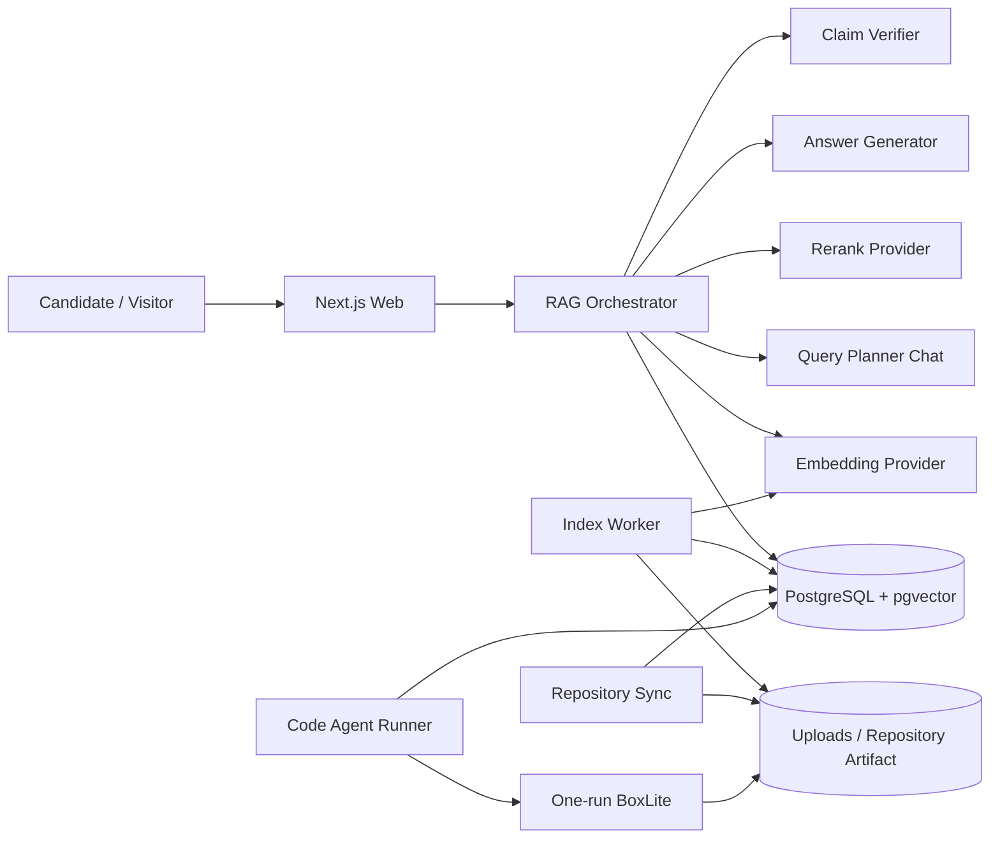
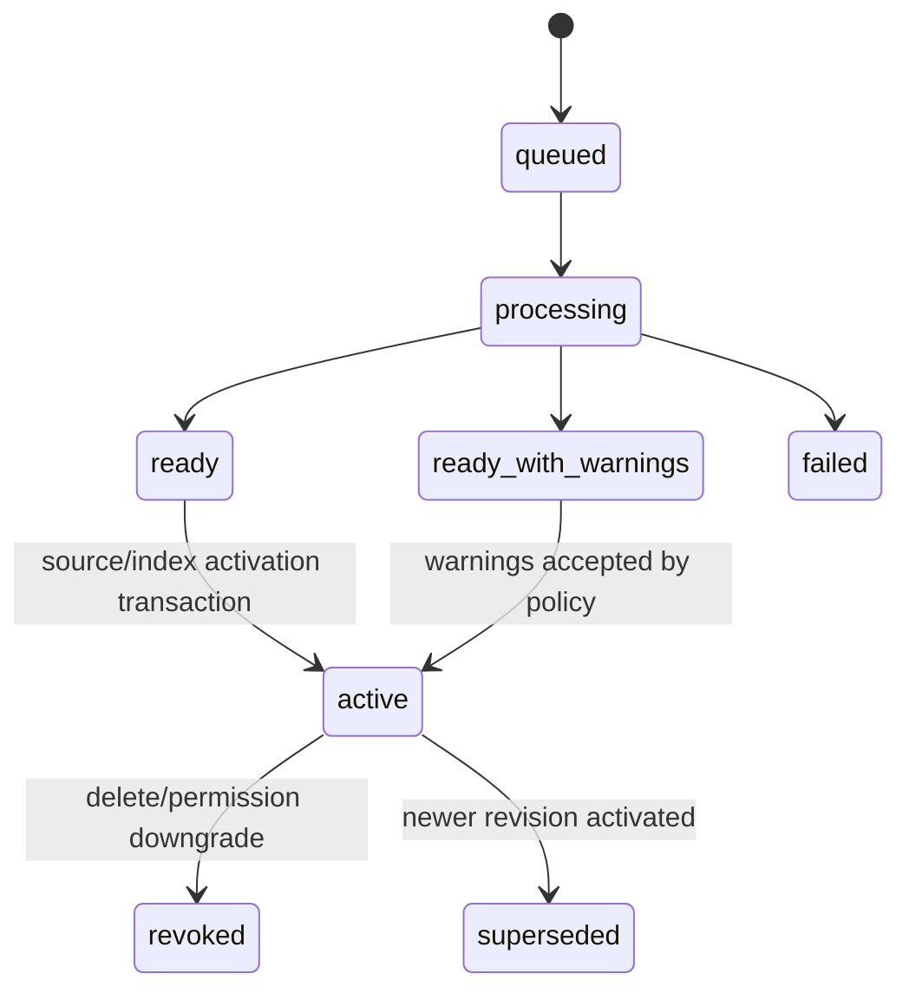
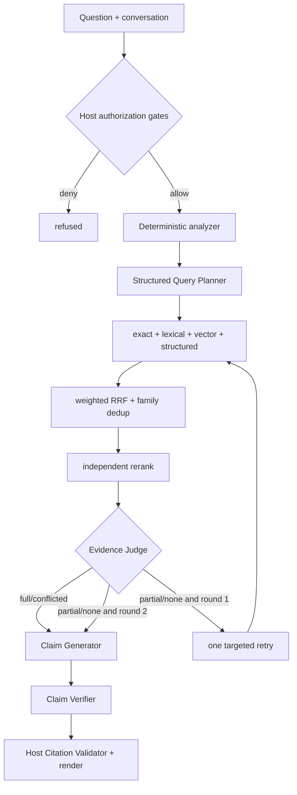

# DESIGN-005：Hybrid Agentic RAG V2 与隔离源码分析系统设计

Boundary ID：`askme-hybrid-agentic-rag-runtime-v2`

Owner boundary：满足 [SPEC-002](../specs/SPEC-002.md) 的版本化索引、Repository 文档、混合检索、有界 Agent、Citation、权限、观测与隔离源码分析架构。

Status：`active`

当前修订 Plan：[PLAN-020](../plans/PLAN-020.md)

## 1. 目标、现状与不变量

Askme 继续使用 Next.js、PostgreSQL、Node worker、Docker Compose 和现有 Repository Artifact/Code Agent Runtime。V2 直接替换 `chunks.search_vector + websearch_to_tsquery` 的 V1 文档问答：持久索引统一承载 Material、Knowledge anchor、Approved Wiki 与已批准 Repository Markdown/PDF，再由有界 Agent 完成 Query Planning、四路召回、RRF、Rerank、Evidence Judge、一次补检、Claim Verifier 和 Citation Validator。

当前实现的关键差距：

- `buildEvidenceSearchQuery` 使用连续 `\p{L}` 匹配中文，整句会成为 PostgreSQL 的单个长 lexeme；
- Material chunk 固定按约 `1,200` 字符、`160` 字符 overlap 切分，不理解履历和文档结构；
- 普通回答只取 8 条 Evidence，并把 Evidence Pack 固定截断为约 28,000 字符；
- Approved Wiki 在请求时临时切 section，Repository Markdown/PDF 不进入长期索引；
- Provider 只有 Router/RAG/Code Chat Profile，没有独立 Embedding、Rerank 或 Claim Verifier；
- `postgres:18-alpine` 不含 pgvector extension。

系统不变量：

1. Host 在检索前确定 owner、caller mode、publication、visibility、source state、active revision 和 active index；任何模型不能扩大集合。
2. 原始业务数据与派生检索数据分离。V2 迁移可以重建派生表，不能删除账号、Source、Knowledge Item、Repository、权限和会话。
3. 一个查询只使用一个 active index version；Embedding model、dimension、prefix 或 chunking 不同的向量不得混合。
4. Repository 文档索引只读取成功同步的不可变 commit；原始源码仍只进入一次性只读 Deep Analysis。
5. 所有来源正文、对话历史和 Repository 指令都是不可信数据，不能改变 system contract、权限或工具。
6. Answer 生成、Claim 验证、Citation 校验与消息持久化是分离边界；任何一步失败都不能发布未验证 Claim。
7. 权限撤销立即作用于 active 检索与历史 Citation；延迟 GC 不等于延迟授权。

## 2. 关键选型与权衡

| 决策 | V2 选择 | 理由 | 未选择 |
| --- | --- | --- | --- |
| Vector store | 同一 PostgreSQL 18 + pgvector | 复用 tenant filter、事务、迁移、备份和运行入口 | Milvus、Qdrant、DashVector、独立向量服务 |
| Vector search | 过滤后的 exact cosine | 初始规模下 perfect recall，避免 ANN filter 漏召回 | 默认 HNSW/IVFFlat |
| Chunk | structure-first Parent–Child | 小 Child 提升召回，Parent 保留完整职业/文档上下文 | 固定字符窗口、句子碎片 |
| Fusion | weighted RRF + independent rerank | 词法/向量分数量纲不同，RRF 稳定；Rerank 独立优化回答相关性 | 直接加权原始分数、Chat LLM 排序 |
| Agent | Host 编排的最多两轮 bounded workflow | 保持权限、延迟和失败可控 | 自由工具循环、无界自反思 |
| Claim grounding | 结构化 Claim + 独立 Verifier + Host validator | 模型不能同时担任唯一生成者和裁判 | 只靠 Prompt 要求引用 |
| Repository 文档 | approved Repository 的 Markdown/PDF 进入相同索引 | README/docs 是直接、可引用的职业项目证据 | 只检索派生 Wiki、源码全量 Embedding |
| Feedback | 离线标签 + versioned policy | 可评估、可回滚，不形成线上自修改闭环 | 点踩自动调权、自动改 Knowledge |

pgvector 官方支持 exact/approximate、cosine 与 PostgreSQL filter；本地 Compose 使用已验证存在的 `pgvector/pgvector:pg18` 镜像，并由 migration 执行 `CREATE EXTENSION IF NOT EXISTS vector` 与 `pg_trgm`。

## 3. 系统上下文



Web 负责同步命令、问答 API、Candidate/Admin Trace 和 Citation projection。Worker 负责材料/Repository 文档解析、Parent–Child、Embedding、索引激活和失败 reconcile。普通 RAG 不启动 BoxLite；只有实现级源码问题经过既有 deterministic gate 后创建 `conversation_analysis` run。

## 4. 组件与依赖方向

| 组件 | 单一职责 |
| --- | --- |
| `RagConfig` | 解析、校验并隐藏 Provider、TopK、RRF、token budget、chunk 和 Repository 文档默认值 |
| `EmbeddingProvider` | 批量把版本化 contextual text 转为固定 1024 维向量，校验数量、维度和 finite number |
| `RerankProvider` | 对一个 query 的候选正文返回请求内相对排序，不跨请求比较 score |
| `StructureChunker` | 解析 source structure，生成 Parent、Child、原始范围、stable checksum 和 contextual prefix |
| `IndexCoordinator` | 创建 index/source version、调度 job、原子激活、失败保持旧 active、强撤销和 GC |
| `RepositoryDocumentCollector` | 在 immutable artifact 内按 allowlist/glob/容量发现并提取 Markdown/PDF 文本 |
| `DeterministicQueryAnalyzer` | Unicode、中文片段、CJK n-gram、实体、精确短语、混合语言与会话指代 seed |
| `QueryPlanner` | 输出受 schema 约束的 standalone query、terms、semantic queries 和 evidence type |
| `HybridRetriever` | 在同一授权集合并行执行 exact、lexical、vector、structured 并返回 route ranks |
| `RrfFusion` | 按配置化 weight/k 合并、stable dedup、Parent 限流和 evidence-family 标记 |
| `EvidenceJudge` | 独立 Rerank 后判断 coverage、unsupported aspects 与是否执行唯一补检 |
| `AnswerGenerator` | 输出结构化 claims/evidenceIds，不拥有授权或最终 Markdown |
| `ClaimVerifier` | 只对每条 Claim 的引用 Evidence 判断 entailment/contradiction |
| `CitationValidator` | 重新读取 active/auth/checksum，校验 Claim-Citation，Host 渲染最终 Markdown |
| `RetrievalTraceStore` | 保存安全 metadata、route count/rank/outcome/degradation，不保存向量或未授权正文 |

依赖只能从 Orchestrator 指向 Provider/Repository interface；Provider 不访问数据库，模型输出不直接写消息，Repository Collector 不修改 artifact。

## 5. 持久数据模型

### 5.1 `rag_index_versions`

全局索引配置 owner：

| 字段 | 语义 |
| --- | --- |
| `id` | UUID |
| `state` | `building | ready | active | failed | superseded` |
| `chunking_version` | StructureChunker 合同版本 |
| `embedding_provider/model/dimensions` | 默认 Qwen/`qwen3.7-text-embedding`/1024 |
| `context_prefix_version` | contextual prefix 版本 |
| `distance_metric` | `cosine` |
| `created_at/activated_at/failure_code` | 生命周期与安全错误 |

全库同一时间只有一个 active index version。新配置重建在独立 version 下完成；只有全部要求的 source versions ready 且 Golden gate 可执行时才切换 active。首次 V2 migration 不保留 V1 query path，但仍用此机制保证重建失败不会产生半成品检索。

### 5.2 `rag_source_versions`

统一表示一个可索引来源 revision：

| 字段 | 语义 |
| --- | --- |
| `owner_id` | tenant filter |
| `source_kind` | `material | approved_wiki | repository_markdown | repository_pdf` |
| `source_id` | Material、Wiki page 或 Repository id |
| `source_revision` | material checksum、projection checksum 或 `commit:path:content_hash` |
| `index_version_id` | 所属 global index version |
| `state` | `queued | processing | ready | ready_with_warnings | failed | revoked` |
| `visibility` | 入库快照，仅用于诊断；查询仍 join 当前业务 owner |
| `evidence_family_id` | 原始/派生血缘 |
| `metadata` | title、path、commit、page/line、warning 等安全 JSON |
| `parent_count/child_count/token_count` | readiness 与观测 |

逻辑 source + index version + revision 唯一。Repository 文档的 `source_id` 使用 Repository id，`source_revision` 固定 commit/path/checksum；查询必须 join `repositories.active_revision_id`，不能只信 metadata。

### 5.3 `rag_parent_chunks` 与 `rag_child_chunks`

Parent 保存原始完整上下文、token count、structure path、source range 和 checksum。Child 保存 parent id、position、原始文本、contextual text、token count、`tsvector`、trigram 可检索正文和 `vector(1024)` embedding。所有表重复保存 `owner_id + index_version_id + source_version_id` 以允许数据库约束和先过滤后排序；foreign key 必须阻止跨 owner 关联。

Child stable key 由 `source_revision + structure_path + normalized_range + content_checksum` 计算，不以数组 position 作为跨重建身份。Knowledge Item structured route 先读取现有 `knowledge_sources/knowledge_evidence`；V2 重建后由 `knowledge_sources` 将 anchor 重新绑定到该 Material 的 active Child，不把 Candidate summary 复制成最终 Evidence。

V1 `chunks`、其 search vector 和派生 `knowledge_evidence` 可以在 V2 build 成功后清空或退出读取路径；已有 Message/Conversation 保留。无法重建的历史 V1 Citation 标记 `evidence_revoked`，不级联删除消息。

### 5.4 Trace 与反馈

`rag_query_traces` 保存 conversation/message、caller mode、policy/index version、Planner safe JSON、每 route count、selected evidence IDs/scores、coverage、round count、degradation、token budget 和 latency。表不保存 question、evidence正文、Prompt 或 vector；Candidate 只能读自己的 trace，Admin API 只返回诊断字段。

`rag_feedback` 保存 message、owner、`up | down | correction`、可选安全标签和 policy version。correction 正文按 Candidate 私有数据处理，但不进入索引或 Prompt，只有离线 eval export 显式读取。

## 6. 索引流水线



### 6.1 Material / Approved Wiki

Material 继续由现有 ingestion job 提取原始文本，但 persistence 改为：提取结构 → Parent/Child → Embedding batch → source version ready → activation transaction。生成摘要/Knowledge Item 可以读取 ready Parent，不再负责定义 chunk identity。

Approved Wiki 以 active projection page 和 H2/H3 section 作为结构输入；每个 section 保留实际 `[S*]` marker 与 Repository source ranges。Wiki 进入 `evidence_family` 后可参与检索，但 RRF/Verifier 优先投影到原始 Material/Repository document；只有 Wiki 的 Host-verified source 能独立引用。新的 projection 批准后，旧 projection 的 Wiki source 必须在同一协调流程中 supersede，随后按非 revoked/superseded source 重算 active index expected count；Repository 文档 readiness 只统计 Markdown/PDF，不能把 Wiki page 混入文件数。

### 6.2 Repository 文档

Repository sync 成功后，Collector 从 content-addressed artifact 读取 manifest，不从 GitHub live branch 拉取。默认 allowlist 与 Candidate include/exclude 使用 `minimatch`；默认安全 excludes 不可被反向 include。

Markdown 解析 heading/list/table/code-fence 边界，并计算源行范围。PDF 复用 `pdfjs-dist` 直接文本提取，按 page/block 记录页码；空文本或质量阈值不达标时标记 `unsupported_no_extractable_text`，不调用 OCR。单文件/页/revision token 预算超限产生 warning 和 skip reason，不截断证据。

Repository 首次处于 private 时可以预建 private index 以缩短后续切换，但检索仍不可使用；最小实现也可以在 visibility 提升时构建。实现必须保证 visibility 是 Repository 级 owner，新增/变化 path 自动继承，删除 path 使旧 source version revoked。

### 6.3 并发与幂等

复用 PostgreSQL job lease + `FOR UPDATE SKIP LOCKED`。幂等键包含 owner、source kind/id/revision、index version 和 extractor version；Provider retry 不创建重复 Parent/Child。一个 source version 只有 lease holder 可以提交 ready；激活事务重新检查当前业务权限与 revision。

Embedding batch 使用配置化并发、batch size、timeout 和 retry；429/5xx 可退避，dimension/schema/invalid-number 是永久失败。旧 active 只有在新 source ready 后 supersede。

## 7. Query Planning 与多路检索



### 7.1 Deterministic Query

`DeterministicQueryAnalyzer` 先执行 NFKC、空白/标点规范化、Latin token lowercase、中文短语候选与 2/3-gram、数字/版本/专名保留。它生成 exact phrases、FTS lexemes、trigram probes 和 semantic seed；中文不再通过 `websearch_to_tsquery` 的单个整句 OR 字符串表达。

Query Planner 使用独立 Chat Profile 和严格 Zod schema。Planner 输入只包含当前问题、受控会话摘要和 Host 已授权的 source type 列表，不包含未检索正文。输出不得携带 SQL、tenant、visibility 或 tool call。失败、超时或 schema invalid 时直接使用 deterministic plan。

### 7.2 Route SQL

- exact：规范化正文/标题/实体字段的 phrase equality、substring 和 stable alias；
- lexical：`plainto_tsquery`/`to_tsquery` 的安全 lexeme，加 `pg_trgm` similarity/ILIKE probe；
- vector：把最多两个 semantic query 分别 Embedding，join 当前 active source/index，按 `<=>` cosine distance 排序；
- structured：Knowledge title/summary/type、Material/Repository metadata 和 `knowledge_sources` 关系，只作为 anchor rank。

每路先应用 owner、allowed visibility、status、active revision、active index 和 revoked 条件。默认 TopK/weight 为 exact `20/1.5`、lexical `30/1.0`、vector `30/1.0`、structured `20/1.2`。RRF 默认 `k=60`，按 stable Child 合并；同 Parent 默认最多三个 Child，同 evidence family 不重复增信。

### 7.3 Rerank 与补检

Rerank adapter 按独立 Base URL 和 `provider protocol` 调用 `qwen3-rerank`：`dashscope-compatible` 使用 Workspace 专属 `compatible-api/v1/reranks`、顶层 `results` 与固定问答检索 `instruct`，`cohere-compatible` 使用 `/reranks` 且不发送 DashScope 专属字段。请求包含 query、candidate contextual text 和 `top_n`。Host 只接受输入 index 范围内的唯一结果和 `0..1` finite score；score 仅在当前请求内使用。

Rerank 未配置、超时或失败时使用 RRF，Trace 标记 degradation，Judge 提高 full 阈值。Judge 根据 aspect coverage、family 独立性、矛盾和 source quality 输出 coverage。只有 round 1 partial/none 才构造 unsupported-aspect retry plan；round 2 无论结果如何都停止。

## 8. Evidence Pack、Claim 与 Citation

Evidence Pack Builder 先按 Rerank/Parent/family 选择，再计算 token。配置的 `200,000` 是 hard ceiling；effective ceiling 必须扣除 system、conversation、output reserve 和 safety margin。Builder 以 full coverage 提前停止，不为了填满预算加入弱 Evidence。

Answer Generator 输出：

```text
coverage
claims[] = { claimId, aspectId, text, evidenceIds[] }
unsupportedAspects[]
```

Host 在 Verifier 前重新加载 evidence IDs 并核对 owner、active source/index、visibility、checksum。Claim Verifier 每次只接收一个或一小组 Claim 及其 cited subset，输出 entailed/partial/unsupported/contradicted 和可选 narrowed text。一次 repair 只能删除或收窄 Claim，不能新增 evidence ID。

Citation Validator 确认每条最终 Claim 至少一个 entailed Evidence；Material 使用 Child range/checksum，Repository Markdown 使用 commit/path/lines/checksum，PDF 使用 commit/path/page/checksum，Wiki marker 必须映射当前 Approved Projection 的 Host-verified source。Host 按用户语言渲染 Markdown 和 Citation DTO，模型不能直接决定内部 URL。

互相冲突的 Evidence 由 Judge 标记 `conflicted`；Answer 只能说明冲突和各自来源，不能选择“看起来更新”的一方。`partial` 只渲染已支持方面并列出缺口。Answer/Verifier/Validator failure 使用独立 stable error，不返回 insufficient fallback。

## 9. Provider 与配置

`RuntimeConfig` 新增独立配置：

- `embedding`: API key/base URL/model/dimensions/timeout/retry/batch/concurrency；
- `rerank`: API key/base URL/model/provider protocol/timeout/retry/topN；
- `planner` 与 `verifier`: Chat Profile；
- `retrieval`: route TopK、weights、RRF k、Parent/Child limit、round limit；
- `evidence`: max tokens `200000`、output reserve、safety margin；
- `chunking`: child/parent targets、hard max、min、overlap；
- `repositoryDocuments`: include/exclude、Markdown/PDF/revision limits。

环境 allowlist 包含用户已配置的 `ASKME_EMBEDDING_MODEL_API_KEY`、`ASKME_EMBEDDING_MODEL_API_BASE_URL`、`ASKME_EMBEDDING_MODEL`，默认 dimensions 为 1024。Rerank 使用 `ASKME_RERANK_MODEL_API_KEY`、`ASKME_RERANK_MODEL_API_BASE_URL`、`ASKME_RERANK_MODEL=qwen3-rerank` 和 `ASKME_RERANK_PROVIDER_PROTOCOL`，不从 Embedding Secret 静默派生；部署者可以显式把二者设置为相同 key。

Embedding/Rerank adapter 使用最小 fetch HTTP contract，不强行把非 Chat endpoint 塞进现有 `openai` Chat adapter。Provider 原始错误正文不进入数据库/UI；只记录 request id（若安全）、latency、token/数量和 stable code。

## 10. 权限、强撤销与安全

检索 SQL 必须从当前业务 owner join：Material 要求 `status=indexed` 和 allowed visibility；Repository 文档要求 Repository 未 disabled、active revision 精确匹配且 visibility allowed；Wiki 要求 active approved projection。`rag_source_versions.visibility` 只用于审计，不作为授权事实源。

Repository 设置以整个 Repository 为唯一发布 owner。visibility 从 private 提升后全部白名单文档可用；后续新增/修改自动继承。降低 visibility、删除、publication revoke 或账号停用时，事务先更新业务状态并使相关 source versions revoked，再返回成功；Embedding row 的物理删除异步执行。

历史消息读取先验证其 Evidence 仍授权。Repository 权限降低时，引用该 Repository 且超出新可见性范围的回答在同一事务中持久标记失效；失效 Citation 投影为 revoked，后续恢复 visibility 或重建 source 不清除该标记。回答依赖失效 Evidence 时状态投影 `evidence_revoked`，只能由新问题生成新回答。不复制私有正文到消息或 Trace，避免撤销后仍可从 snapshot 读取。

Prompt Injection 防护使用结构化消息边界、固定 system contract、Evidence delimiter 和工具为空的 Chat calls。材料中的“指令”不经过任何动态注册路径。Planner 不读取 Evidence，Rerank 无工具，Generator/Verifier 只接收 Host 选择的正文；所有输出经过 schema 与 allowlist 校验。

## 11. Retrieval Trace、状态与反馈

每个 query 建立 trace id，并在相同 owner 下追加 stage metadata。UI 只展示：policy/index/commit、Planner terms、route counts、selected evidence ids/title/score、coverage、round、budget、degradation、filter/warning 和 stage latency。Candidate 可以展开自己的 trace；Admin 默认只看聚合/安全 metadata，只有通过既有治理授权进入 tenant 诊断时才看相同安全投影。

Repository 页面把 sync 与 index 分栏：sync state、requested/full SHA、artifact ready；index state、active commit、files indexed/skipped、warning/error、last activated。Material 页面同样区分 extracted/indexing/ready/failed。

Feedback API 只写 `rag_feedback`，不调用 Provider、不更新 policy、不创建 Knowledge Item。离线 eval runner 可以导出匿名 case 候选，但真实用户问题和材料默认不进入仓库 fixture。

## 12. 失败、恢复与观测

| 失败 | 行为 | 恢复 |
| --- | --- | --- |
| Embedding 未配置/失败 | Query 降级 lexical；新 source index failed 或 retry | 配置恢复后重跑 source/index version |
| Rerank 未配置/失败 | RRF + strict Judge | 下次请求自动重试 Provider |
| Planner invalid | deterministic plan | 不持久失败状态 |
| Answer/Verifier invalid | message failed，不伪装 none | 用户安全重试，新 trace |
| Citation invalid/revoked | 不提交最终回答 | 重新检索；不能复用旧 Evidence |
| Repository file unsupported | ready_with_warnings + skip reason | 调整 glob/limit 或后续 OCR 版本 |
| Worker crash | lease expiry 后幂等恢复 | 旧 active 继续服务 |
| 新 global index failed | 保持旧 active index | 修复后新 version 重建 |

指标至少包含 source indexing latency/count/failure、Embedding batch latency/tokens/errors、route hit count/latency、exact vector P50/P95、Rerank latency/errors、coverage distribution、false-none eval、Citation failure、revocation filter 和 actual evidence tokens。日志只使用 id、state、count、duration、stable code，不打印 question、正文、vector、Prompt 或 Secret。

HNSW gate 由 active vector count 和 exact query P95 触发离线评估；实现不自动建 HNSW。达到 `100,000` 或 P95 `>100 ms` 后，只有 Recall@30 不低于 exact 门禁时才能通过新 migration/policy 启用。

## 13. V2 迁移与直接切换

1. Compose DB image 切换为 `pgvector/pgvector:pg18`，migration 安装 `vector` 与 `pg_trgm`。
2. additive 创建 V2 index/source/parent/child/trace/feedback 表和必要 enum/constraint；业务表不删除。
3. 创建一个 building index version，Worker 从现有 indexed Materials、Knowledge source、active Approved Wiki 和 approved Repository active revision 重建。
4. 120 题门禁通过后把 V2 index 标记 active，并把 V1 retrieval code 从运行路径删除；不做双写或 feature flag。
5. 清空/保留 V1 派生表只按 foreign key 安全性决定；历史消息保留，无法验证的旧 Citation 投影 revoked。
6. 应用回滚可以恢复前一镜像，但 V1 问答不作为产品兼容目标；数据库回滚不删除 V2 表，旧 active source/index 可供 V2 重建恢复。

本地真实部署必须记录前后 users/materials/knowledge_items/repositories/conversations/messages 数量，证明业务数据未丢失；派生 chunk/vector 数量可以变化。

## 14. Golden Dataset 与验证

仓库 fixture 使用至少三名虚构 Candidate，材料与 Evidence ID 稳定。120 case 以 JSON/JSONL 保存 question、conversation turns、caller、expected coverage/outcome、required/forbidden evidence IDs、可支持目标 Claim 的 acceptable Citation IDs 和 tags；`requiredEvidenceIds` 只约束必须召回的 canonical evidence，不能误作唯一合法 Citation。Eval runner 分两层：

1. deterministic/provider-stub 层验证 permission、query、route、RRF、family dedup、budget、Claim/Citation 和 failure semantics；
2. configured real Provider 层计算 Recall@30、Rerank Recall@8、Citation precision、false none、hallucination、unauthorized leak 和 outcome classification。

Provider 非确定输出不以逐字答案为 gold；gold 只约束 outcome、Claim key facts 和 Evidence IDs。Prompt Injection、conflict、duplicate family、Repository commit 切换、强撤销和所有降级模式必须有 case。

自动化门禁包括 unit、PostgreSQL integration、migration-from-current-data、provider contract、worker lease、security、API 和 full build。真实验收使用 `nuibizi@qq.com`：验证富途职责中文改写能命中上传简历、回答包含正确 Material Citation、Retrieval Trace 显示非零 route；再验证一个 approved Repository Markdown/PDF 问题及 Repository 撤销后的历史 Citation。

## 15. 隔离源码分析保留边界

现有 `src/server/code-agent`、`analysis_runs`、BoxLite microVM、Pi guest 只读工具、SSE 和 Host Citation 校验继续服务 `deep`。V2 修改只限于：Router 在文档 RAG 后决定是否需要源码检查、最终 Citation 进入统一授权投影、Retrieval Trace 记录 route transition。

Deep run 仍绑定一个 owner、Repository、完整 SHA 和 artifact checksum；每 run 新 microVM，不挂载 Host 工作树，不持有 GitHub Token，不执行 Shell/build/test/install/network。中间 reasoning/tool output 不持久化，cleanup 成功后才提交最终回答；失败不回退成伪成功 RAG。

## 16. 外部选型依据

- pgvector 官方支持 PostgreSQL 内 exact/approximate nearest-neighbor、cosine distance、filter、FTS + RRF/cross-encoder 混合检索；V2 初始只用 exact。
- 阿里云百炼官方说明 `qwen3.7-text-embedding` 支持 256–2560 自定义维度和多语言长文本，V2 固定 1024 维避免同索引混维度。
- 阿里云百炼官方 `qwen3-rerank` 接口返回输入 document index 与请求内 `relevance_score`，因此 adapter 只用它排序当前候选，不把分数当跨请求阈值。
